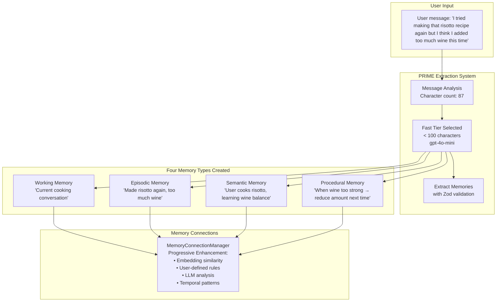
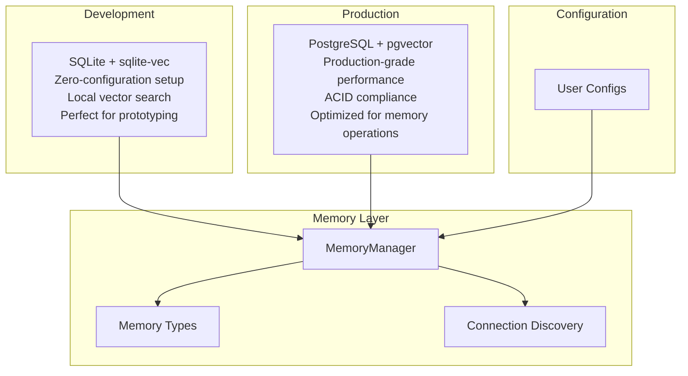

# AgentDock Core Memory System

> A four-layer memory architecture that gives AI agents human-like memory capabilities

The AgentDock Memory System transforms how AI agents remember, learn, and connect information across conversations. Unlike traditional stateless AI interactions, our memory system creates persistent, intelligent agents that build knowledge over time through **Conversational Retrieval-Augmented Generation (RAG)** - dynamically retrieving and injecting relevant memories into agent responses.

## Key Technical Innovations

AgentDock introduces potentially revolutionary approaches to conversational memory:

- **Four-Dimensional Memory Fusion**: Combines vector + text + temporal + procedural relevance scoring (beyond typical vector-only RAG systems)
- **PRIME Extraction System**: Cost-optimized intelligent memory extraction with automatic 2-tier model selection  
- **Hybrid SQL + In-Memory Graph**: Graph-like memory connections without dedicated graph database complexity
- **Research-Validated Hybrid Search**: 30% text + 70% vector configuration prevents catastrophic failures on specialized domains
- **Progressive Memory Connections**: Multi-tier relationship discovery that scales from embedding similarity to LLM analysis

These innovations work together to create conversational agents that truly learn and evolve while remaining operationally simple for production deployment.

### Intelligence Features

- **Memory Consolidation**: Automatic optimization through episodic→semantic conversion and deduplication - reduces storage and improves recall quality
- **Graph Analysis**: Multi-hop traversal and clustering via ConnectionGraph for discovering indirect relationships - now actively integrated
- **Temporal Patterns**: Activity detection and behavioral insights through statistical analysis with optional LLM enhancement

Note: All intelligence features use computational resources (database queries, CPU cycles, memory). Optional LLM enhancements incur additional API costs.

## What is Memory in AgentDock?

Memory in AgentDock is a **multi-layered cognitive architecture** that mirrors human memory patterns:

- **Working Memory**: Immediate conversation context (like your mental notepad)
- **Episodic Memory**: Time-ordered experiences and events (like your personal diary)  
- **Semantic Memory**: Facts, knowledge, and learned concepts (like your personal encyclopedia)
- **Procedural Memory**: Learned patterns and successful action sequences (like your muscle memory)

Each layer serves a distinct purpose and works together to create agents that truly learn and evolve.

## Current Implementation Status

| Component | Status | Notes |
|-----------|--------|-------|
| Four-Layer Memory Architecture | ✅ Implemented | Working, Episodic, Semantic, Procedural |
| PRIME Extraction System | ✅ Implemented | Intelligent tier selection with cost controls |
| Hybrid Search (30-70 split) | ✅ Implemented | PostgreSQL and SQLite adapters |
| Memory Connections | ✅ Implemented | Progressive enhancement approach |
| Preset Configurations | ✅ Implemented | Default, Precision, Performance, Research |
| Lazy Memory Decay System | ✅ Implemented | On-demand decay calculation, 65-100% write avoidance |
| Temporal Pattern Integration | ✅ Implemented | Pattern storage, recall boost, decay influence |
| Configurable Connection Hops | ✅ Implemented | 1-3 hops based on recall preset |
| Basic Evolution Tracking | ✅ Implemented | Memory lifecycle events (created, accessed) |

## Work in Progress - Full System Integration

The memory system is production-ready and the following integrations are being developed to wire everything together:

| Integration | Target | Description |
|-------------|--------|-------------|
| Message Persistence Layer | Q3 2025 | Server-side conversation history storage for seamless memory extraction |
| HTTP/REST Adapter | Q3 2025 | Universal API access for agentdock-core operations |
| Session Management Bridge | Q3 2025 | Automatic conversation-to-memory pipeline |
| Workflow Learning Service | Q3 2025 | Public API for procedural memory patterns |

These enhancements will enable the memory system to automatically process conversations from any HTTP source. The agentdock-core transformation and open source client evolution are actively under development.

## How AgentDock Memory Works

When a user sends a message to your agent, the **PRIME (Priority Rules Intelligent Memory Extraction)** system intelligently processes it:



**The Four-Layer Architecture** ensures each type of information is stored optimally:
- **Working Memory** maintains conversation context
- **Episodic Memory** preserves the specific experience  
- **Semantic Memory** extracts general knowledge
- **Procedural Memory** learns patterns for future recommendations

## Storage Architecture

AgentDock follows a **configurable storage strategy** optimized for different environments:

### **Why SQL + In-Memory Instead of Graph Databases?**

AgentDock deliberately uses a **hybrid SQL + in-memory graph approach** rather than dedicated graph databases (Neo4j, ArangoDB). This architectural decision provides graph-like functionality while maintaining operational simplicity:

- **No additional infrastructure** - Works with your existing PostgreSQL or SQLite database
- **Optimized for agent scale** - Perfect for 100-10,000 memories per agent (not billions like social networks)
- **Fast common queries** - Most agent queries are 1-3 hops, where SQL performs excellently
- **Operational simplicity** - Standard backup, monitoring, and deployment procedures



## Core Features

### **Research-Based Design**
Based on established cognitive science principles, AgentDock implements proven memory concepts:
- **Spreading Activation**: Related memories activate automatically  
- **Episodic-Semantic Interdependence**: Experiences become general knowledge over time
- **Connection Types**: Grounded in semantic network theory (similar, causal, temporal, hierarchical)

### **PRIME Extraction System**
Intelligent, cost-optimized memory extraction:
- **Character-based tier selection**: Automatically routes to optimal model (standard/advanced)
- **Budget controls**: Monthly spending limits and usage tracking
- **Validated output**: Type-safe memory creation with Zod schema validation
- **Graceful degradation**: Falls back to pattern-based extraction when needed

### **Progressive Memory Connections**
Multi-tier relationship discovery that balances cost and capability:
1. **Embedding similarity**: Vector-based semantic relationships
2. **User-defined rules**: Custom pattern matching for domain logic  
3. **LLM enhancement** (optional): AI-powered deep relationship analysis
4. **Temporal patterns**: Time-based connection heuristics

Uses hybrid SQL + in-memory graph approach for simplicity without sacrificing functionality.

### **Conversational RAG**
Infrastructure-level retrieval-augmented generation:
- **Hybrid search**: Research-validated 30% text + 70% vector prevents failure modes
- **Four-dimensional fusion**: Vector + text + temporal + procedural relevance scoring
- **Automatic injection**: Agent runtime integration without manual prompt construction

### **Memory Recall Presets**
Ready-made configurations for different agent types:
- **Default**: Balanced for general-purpose applications
- **Precision**: Exact terminology for medical/legal/financial agents  
- **Performance**: Optimized for high-volume customer support
- **Research**: Enhanced connection discovery for analysis and content discovery

### **Production-Ready Architecture**
- **Configurable memory decay**: Human-like forgetting with rule-based protection
- **Specialized memory adapters**: Production-ready implementations for PostgreSQL (pgvector) and SQLite
- **Community-extensible adapters**: Base classes available for ChromaDB, Pinecone, and Qdrant
- **User isolation**: Complete data separation with proper security
- **Cost tracking**: Built-in monitoring and budget controls

## Use Cases

AgentDock memory enables agents that learn and evolve across conversations:

### **Customer Support Evolution**
**Day 1**: Customer reports account lock issue  
**Day 15**: "Hi, it's John again, different issue with billing"  
**Agent Response**: "Hi John! I see you had an account issue before. How can I help with billing?"

The agent recalls previous interactions, communication preferences, and successful resolution patterns.

### **Coaching Agent Development**  
**Session 1**: User reports stress, sleep issues, recent divorce  
**Session 5**: User shares presentation success and exercise progress  
**Agent Learning**: Connects stress patterns to life changes, identifies effective coping strategies, reinforces positive behaviors

**Procedural Memory Development**:
- When user reports anxiety → suggest proven breathing exercises
- When presentations mentioned → recall past successes  
- When progress reported → reinforce positive patterns

### **Research Assistant Growth**
**Month 1**: Tracks literature on specific topics  
**Month 3**: Identifies patterns across research domains  
**Month 6**: Suggests novel connections and research directions based on accumulated knowledge

## Quick Start

### **Simple Setup with Presets**
```typescript
import { createMemorySystem } from 'agentdock-core';

// Development setup
const memory = await createMemorySystem({
  environment: 'local'
});

// Production with preset optimization
const memory = await createMemorySystem({
  environment: 'production',
  recallPreset: 'precision',        // For medical/legal/financial
  databaseUrl: process.env.DATABASE_URL
});

// Two primary methods for adding memories:

// METHOD 1: Manual Direct Storage (bypasses PRIME extraction)
// Use when you know exactly what memory to create
const manualMemoryId = await memoryManager.store(
  'user-123',
  'agent-456', 
  'User prefers dark mode interfaces',
  MemoryType.SEMANTIC  // or 'semantic' string
);

// METHOD 2: Automatic PRIME Extraction (AI-powered)
// Processes messages to intelligently extract multiple memories
const extractedMemories = await memory.addMessage('user-123', {
  id: 'msg-789',
  agentId: 'agent-456',
  content: 'I prefer email notifications over SMS and usually check my email in the morning',
  role: 'user',
  timestamp: Date.now()
});
// Returns array of memories extracted by AI

// Advanced: Batch conversation processing with PRIME
import { PRIMEOrchestrator } from 'agentdock-core';
const result = await primeOrchestrator.processMessages(
  'user-123',
  'agent-456',
  conversationMessages  // Array of messages
);

// Advanced: Historical memory injection with custom timestamps
// Note: Custom timestamps only work with vector-enabled storage
const historicalMemoryId = await memoryManager.store(
  'user-123',
  'agent-456',
  'User completed onboarding last year',
  MemoryType.EPISODIC,
  { timestamp: Date.now() - (365 * 24 * 60 * 60 * 1000) }
);
```

### **Storage Options**
- **Development**: SQLite + sqlite-vec (zero configuration)
- **Production**: PostgreSQL + pgvector (managed service compatible)
- **Alternative**: ChromaDB, Pinecone, Qdrant adapters available

### **Memory Recall Presets**
- **Default**: Balanced for general use
- **Precision**: Exact terminology (medical, legal, financial)
- **Performance**: High-volume customer support  
- **Research**: Enhanced connection discovery

## Memory Architecture Details

### **Four-Layer Memory System**
- **Working Memory**: Recent conversation context (immediate access, TTL-based)
- **Episodic Memory**: Time-ordered experiences with temporal decay
- **Semantic Memory**: Knowledge and facts with confidence scoring  
- **Procedural Memory**: Learned patterns with reinforcement-based evolution

Each layer has specific configuration options for retention, decay rates, confidence thresholds, and learning parameters.

## Memory Lifecycle Management

**Lazy Memory Decay**: Efficient on-demand decay calculation that scales with usage, not data size
- **65-100% write avoidance**: Only update memories that are actually accessed
- **Exponential decay formula**: Human-like forgetting with configurable half-lives
- **Rule-based protection**: Prevent critical information from decaying (neverDecay flag)
- **Access reinforcement**: Frequently recalled memories stay strong
- **Automatic cleanup**: Remove memories below relevance threshold
- **No scheduled jobs**: Eliminates batch processing failures and resource bottlenecks

Example configurations: Never decay medical allergies, slow decay for user preferences (90 days), faster decay for casual conversations (7 days).

**Performance Benefits**:
- Scales with memory access patterns, not total memory count
- Sub-second processing for typical workloads
- Eliminates the scalability bottleneck of processing millions of memories daily

## Memory Connections

**Progressive relationship discovery** that potentially revolutionizes how agents understand context:

### **Connection Types**
- **Similar**: Semantically related content (stress patterns, topic clustering)
- **Causal**: One thing leads to another (actions → outcomes)  
- **Temporal**: Time-based relationships (events before/after patterns)
- **References**: Explicit mentions and callbacks
- **Hierarchical**: Part-of relationships (details → concepts)

### **Discovery Process**
1. **Embedding similarity**: Vector-based semantic relationships
2. **User-defined rules**: Custom pattern matching for domain logic
3. **LLM analysis** (optional): AI-powered deep relationship discovery  
4. **Temporal patterns**: Time-based connection heuristics

### **Real-World Impact**
**Month 1**: Agent handles individual queries  
**Month 6**: "I remember this pattern... Your parents visit in 2 weeks. How are you and Lisa doing? I know family stress affects how you interact."

The agent learns to connect stress patterns, relationship dynamics, and temporal cues for contextual understanding.

## Production Deployment

### **Development Setup**
- **SQLite + sqlite-vec**: Zero-configuration local development
- **Automatic vector search**: Built-in embedding support
- **Simple installation**: Works with existing SQLite tooling

### **Production Setup**  
- **PostgreSQL + pgvector**: Enterprise-grade vector search
- **Managed service compatible**: Works with RDS, Supabase, Neon
- **Optimized indexing**: IVFFlat and HNSW support for large datasets
- **Connection pooling**: Efficient resource management

## Security and Performance

### **Data Protection**
- **User isolation**: Complete data separation with database-level user ID constraints
- **Session scoping**: Working memory isolated by session ID
- **Configurable encryption**: PostgreSQL field-level encryption support
- **Memory decay**: Automatic cleanup of old memories based on relevance thresholds

### **Performance Characteristics**
- **Retrieval speed**: Sub-100ms for typical queries (100-10,000 memories per user)
- **Vector search**: Optimized with configurable similarity thresholds
- **Caching**: Built-in result caching with configurable TTL
- **Batch processing**: Efficient bulk operations for large conversations

### **Production Considerations**
This is an open-source framework. Users are responsible for:
- Authentication and authorization implementation
- API key and database credential security  
- Network security and access controls
- Regular security audits and monitoring

### **Architecture Philosophy**
**Configurable Determinism**: Reliable, predictable behavior with intelligent fallbacks
- Consistent memory recall based on configured parameters
- AI-powered processing with pattern-based fallbacks
- User-controlled behavior through comprehensive configuration
- Cost tracking and budget controls throughout the system

## Technical Implementation

// ... existing code ...

### Public API

### Factory Functions

```typescript
import { 
  createMemorySystem, 
  createLocalMemory, 
  createProductionMemory 
} from '@agentdock/core/memory';

// Quick development setup
const memory = await createLocalMemory();

// Production configuration
const memory = await createProductionMemory({
  databaseUrl: process.env.DATABASE_URL,
  recallPreset: 'precision',
  encryption: true
});

// Full configuration
const memory = await createMemorySystem({
  storage: {
    type: 'postgresql',
    connectionString: process.env.DATABASE_URL
  },
  recall: {
    preset: 'research',
    weights: {
      vector: 0.45,
      text: 0.25, 
      temporal: 0.20,
      procedural: 0.10
    }
  },
  extraction: {
    tier: 'balanced',
    budget: 100.0
  }
});
```

### Core Components

```typescript
import { 
  MemoryManager,
  RecallService,
  PRIMEExtractor,
  PRIMEOrchestrator 
} from '@agentdock/core/memory';

// Direct component usage
const memoryManager = new MemoryManager(storage, config);
const recallService = new RecallService(memoryTypes, recallConfig);
const extractor = new PRIMEExtractor(extractionConfig);
```

### Memory Operations

```typescript
// Store memories
await memory.store(userId, "User prefers morning meetings");

// Recall with hybrid search
const memories = await memory.recall(userId, "meeting preferences", {
  limit: 10,
  threshold: 0.7
});

// Process conversations
const result = await memory.processConversation(userId, messages);
```

## PRIME Extraction System

The **Priority Rules Intelligent Memory Extraction (PRIME)** system automatically extracts structured memories from conversations using intelligent model tier selection.

### Tier Selection Logic

```typescript
// Character-based automatic tier routing
const getTier = (messageLength: number) => {
  if (messageLength < 100) return 'fast';        // gpt-4o-mini
  if (messageLength < 500) return 'balanced';    // gpt-4o-mini  
  return 'accurate';                             // gpt-4o
};
```

### Extraction Configuration

```typescript
const extractionConfig = {
  tiers: {
    fast: { 
      model: 'gpt-4o-mini', 
      charThreshold: 100,
      timeout: 5000 
    },
    balanced: { 
      model: 'gpt-4o-mini', 
      charThreshold: 500,
      timeout: 10000 
    },
    accurate: { 
      model: 'gpt-4o', 
      charThreshold: Infinity,
      timeout: 15000 
    }
  },
  extractionRate: 1.0,  // Process all messages in production
  costBudget: 100.0,    // Monthly budget limit
  fallbackToRules: true // Pattern-based fallback
};
```

### Memory Output Structure

```typescript
interface ExtractedMemory {
  working: string[];     // Immediate context
  episodic: string[];    // Experiences and events
  semantic: string[];    // Facts and knowledge
  procedural: string[];  // Learned patterns
}
```

## Memory Recall System

### Recall Presets

The system includes four validated preset configurations:

```typescript
const RECALL_PRESETS = {
  default: {      // General purpose
    vector: 0.30, text: 0.30, temporal: 0.20, procedural: 0.20
  },
  precision: {    // Medical, legal, financial
    vector: 0.25, text: 0.45, temporal: 0.20, procedural: 0.10
  },
  performance: {  // High-volume customer support
    vector: 0.20, text: 0.50, temporal: 0.25, procedural: 0.05
  },
  research: {     // Academic, analysis
    vector: 0.45, text: 0.25, temporal: 0.20, procedural: 0.10
  }
};
```

### Hybrid Search Implementation

**PostgreSQL**: Weighted score fusion
```sql
SELECT *, 
  (0.7 * (1 - (embedding <=> query_embedding)) + 
   0.3 * ts_rank(search_vector, query_text)) as hybrid_score
FROM memories 
ORDER BY hybrid_score DESC;
```

**SQLite**: Reciprocal Rank Fusion (RRF)
```typescript
const rrf = (rank1: number, rank2: number, k = 60) => 
  (1.0 / (k + rank1)) + (1.0 / (k + rank2));
```

## Memory Types Implementation

### Working Memory
```typescript
interface WorkingMemoryConfig {
  ttl: number;           // Default: 3600 seconds (1 hour)
  maxSize: number;       // Default: 100 items
  sessionScoped: boolean; // Default: true
}
```

### Episodic Memory
```typescript
interface EpisodicMemoryConfig {
  decay: {
    rate: number;        // Default: 0.1 per day
    protectionRules: string[];
  };
  temporal: {
    granularity: 'hour' | 'day' | 'week';
    clustering: boolean;
  };
}
```

### Semantic Memory
```typescript
interface SemanticMemoryConfig {
  consolidation: {
    enabled: boolean;
    threshold: number;   // Confidence threshold for consolidation
    interval: number;    // Consolidation check interval
  };
  confidence: {
    initial: number;     // Default: 0.5
    reinforcement: number; // Boost on recall
  };
}
```

### Procedural Memory
```typescript
interface ProceduralMemoryConfig {
  learning: {
    reinforcement: number; // Success reinforcement rate
    decay: number;         // Unused pattern decay
  };
  patterns: {
    maxComplexity: number; // Pattern complexity limit
    minSupport: number;    // Minimum pattern support
  };
}

// Note: Procedural memory type provides storage interface.
// Workflow learning and pattern management handled by:
// agentdock-core/src/orchestration/workflow-learning/WorkflowLearningService.ts
```

## Current File Structure

```
agentdock-core/src/memory/
├── index.ts                    # Public API exports
├── MemoryManager.ts           # Core orchestrator
├── create-memory-system.ts    # Factory functions
├── base-types.ts              # Foundational types
│
├── extraction/                # PRIME Extraction System
│   ├── PRIMEExtractor.ts      # Memory extraction engine
│   ├── PRIMEOrchestrator.ts   # Batch processing
│   ├── index.ts               # Extraction exports
│   ├── config/                # Extraction configurations
│   └── __tests__/             # Extraction test suite
│
├── services/                  # Core Services
│   ├── index.ts               # Service exports
│   ├── RecallService.ts       # Memory retrieval
│   ├── EncryptionService.ts   # Security layer
│   ├── RecallServiceUtils.ts  # Utility functions
│   └── RecallServiceTypes.ts  # Service type definitions
│
├── types/                     # Memory Type Implementations
│   ├── index.ts               # Type exports
│   ├── common.ts              # Shared type definitions
│   ├── base/                  # BaseMemoryType foundation
│   ├── working/               # WorkingMemory implementation
│   ├── episodic/              # EpisodicMemory with decay
│   ├── semantic/              # SemanticMemory with consolidation
│   └── procedural/            # ProceduralMemory type (storage interface)
│
├── tracking/                  # Cost & Performance Tracking
│   ├── CostTracker.ts         # Production cost monitoring
│   └── index.ts               # Tracking exports
│
├── intelligence/              # AI-Powered Features
│   ├── connections/           # Memory relationship management
│   ├── consolidation/         # Knowledge consolidation
│   ├── embeddings/            # Vector embedding service
│   └── graph/                 # Connection graph implementation
│
├── lifecycle/                 # Memory Management
│   ├── index.ts               # Lifecycle exports
│   ├── types.ts               # Lifecycle type definitions
│   ├── MemoryEvolutionTracker.ts    # Evolution tracking
│   └── examples/              # Lifecycle usage examples
│
├── decay/                     # Lazy Memory Decay System
│   ├── index.ts               # Lazy decay exports
│   ├── types.ts               # Lazy decay type definitions
│   ├── LazyDecayCalculator.ts       # On-demand decay calculation
│   └── LazyDecayBatchProcessor.ts   # Efficient update batching
│
├── config/                    # Configuration Presets
│   ├── recall-presets.ts      # Preset configurations
│   └── intelligence-layer-config.ts # Intelligence layer settings
│
└── __tests__/                 # Test Suite
    ├── unit/                  # Component tests
    ├── integration/           # Cross-system tests
    └── performance/           # Performance validation

agentdock-core/src/orchestration/workflow-learning/
├── index.ts                   # Workflow learning exports
├── WorkflowLearningService.ts # Procedural pattern management
└── types.ts                   # Workflow learning types
```

## Storage Adapters

### Development: SQLite + sqlite-vec
```typescript
const storage = new SQLiteAdapter({
  path: './memory.db',
  vectorSearch: true,
  encryption: false
});
```

### Production: PostgreSQL + pgvector
```typescript
const storage = new PostgreSQLAdapter({
  connectionString: process.env.DATABASE_URL,
  vectorDimensions: 1536,
  indexType: 'ivfflat',
  encryption: true
});
```

### Alternative: Vector Databases
```typescript
// Note: ChromaDB and Pinecone adapters exist but are not yet optimized for memory operations
// Use PostgreSQL or SQLite for production deployments
```

## Lazy Memory Decay System

The memory system uses **lazy evaluation** for decay calculation, processing only memories that are actually accessed rather than running scheduled batch jobs.

### Core Components

**LazyDecayCalculator**: Calculates exponential decay on-demand during recall operations
- Custom half-life support (7d working, 30d episodic, 90d semantic, 365d procedural)
- Reinforcement for frequently accessed memories  
- Significance threshold (10%) to avoid unnecessary updates
- neverDecay flag for critical information

**LazyDecayBatchProcessor**: Efficiently batches memory updates
- Collects updates from multiple recall operations
- Writes in optimized batches (100 updates per batch)
- Race condition handling with update merging
- Overflow protection (10K pending update limit)

### Configuration

```typescript
const lazyDecayConfig = {
  defaultHalfLife: 30,           // 30 days default
  reinforcementEnabled: true,    // Strengthen accessed memories
  significanceThreshold: 0.1,    // 10% change required for update
  minUpdateInterval: 60000       // 1 minute minimum between updates
};

const batchProcessorConfig = {
  maxBatchSize: 100,            // 100 updates per batch
  flushIntervalMs: 5000,        // 5 second batching
  maxPendingUpdates: 10000      // 10K update limit
};
```

### Performance Benefits
- **65-100% write avoidance** depending on memory access patterns
- **O(accessed) scaling** - only processes used memories
- **No scheduled jobs** - eliminates batch processing failures
- **Sub-second processing** for typical workloads

## Cost Tracking

### Production Monitoring
```typescript
const costTracker = new CostTracker({
  monthlyBudget: 100.0,
  alerts: {
    thresholds: [50, 75, 90], // Percentage alerts
    webhook: process.env.ALERT_WEBHOOK
  },
  breakdown: {
    extraction: true,
    recall: true,
    connections: true
  }
});
```

### Usage Analytics
```typescript
const usage = await costTracker.getUsageReport({
  period: 'month',
  breakdown: 'by_user'
});

console.log({
  totalCost: usage.total,
  extractionCost: usage.extraction,
  userBreakdown: usage.users
});
```

## Configuration Examples

### Customer Support Agent
```typescript
const memory = await createMemorySystem({
  recall: { preset: 'performance' },  // Fast exact-match retrieval
  extraction: { tier: 'fast' },       // Cost-optimized extraction
  decay: {
    rules: ['never_decay:contact_info', 'slow_decay:preferences']
  }
});
```

### Research Assistant
```typescript
const memory = await createMemorySystem({
  recall: { preset: 'research' },     // Enhanced semantic connections
  extraction: { tier: 'accurate' },   // High-quality extraction
  connections: {
    llm: { enabled: true },           // AI-powered relationship discovery
    temporal: { enabled: true }       // Time-based patterns
  }
});
```

### Medical Assistant
```typescript
const memory = await createMemorySystem({
  recall: { preset: 'precision' },    // Exact terminology matching
  extraction: { tier: 'accurate' },   // Medical accuracy required
  decay: {
    rules: ['never_decay:allergies', 'never_decay:medications']
  },
  security: {
    encryption: true,                 // HIPAA compliance
    auditLogging: true
  }
});
```

## Validation & Error Handling

The memory system provides comprehensive validation with fail-fast behavior for production reliability.

### Storage Provider Validation

PRIMEOrchestrator automatically validates storage providers support memory operations:

```typescript
// ✅ Valid storage provider
const storage = new PostgreSQLAdapter(config);
const orchestrator = new PRIMEOrchestrator(storage, primeConfig);

// ❌ Invalid storage provider
const basicStorage = new BasicKVStorage(); // No memory interface
const orchestrator = new PRIMEOrchestrator(basicStorage, primeConfig);
// Throws: "Storage provider must support memory operations. 
//          Ensure your storage provider implements the memory interface."
```

### Configuration Validation

PRIMEExtractor validates critical configuration fields at initialization:

```typescript
// ❌ Missing API key
const extractor = new PRIMEExtractor({
  provider: 'openai',
  apiKey: '', // Invalid
  maxTokens: 4000
}, costTracker);
// Throws: ConfigValidationError: "PRIME apiKey is required. 
//          Provide via config.apiKey or PRIME_API_KEY env var"

// ❌ Invalid provider
const extractor = new PRIMEExtractor({
  provider: 'invalid-provider',
  apiKey: 'sk-...'
}, costTracker);
// Throws: ConfigValidationError: "Invalid provider 'invalid-provider'. 
//          Must be one of: openai, anthropic, azure, bedrock"

// ✅ Valid configuration
const extractor = new PRIMEExtractor({
  provider: 'openai',
  apiKey: process.env.OPENAI_API_KEY,
  maxTokens: 4000,
  modelTiers: {
    fast: 'gpt-4o-mini',
    balanced: 'gpt-4o-mini', 
    accurate: 'gpt-4o'
  }
}, costTracker);
```

### Environment Variable Support

Configuration supports environment variable overrides for secure deployment:

```typescript
// Environment variables (recommended for production)
PRIME_API_KEY=sk-...
PRIME_PROVIDER=openai
PRIME_DEFAULT_TIER=balanced
PRIME_MAX_TOKENS=4000

// Automatic detection in PRIMEExtractor
const extractor = new PRIMEExtractor({
  // Minimal config - env vars provide the rest
  provider: 'openai', // Can be overridden by PRIME_PROVIDER
  apiKey: 'fallback-key' // PRIME_API_KEY takes precedence
}, costTracker);
```

## Timestamp Handling

The memory system provides precise timestamp handling for temporal accuracy and AI SDK integration.

### Message Timestamp Preservation

Memory extraction preserves original message timestamps from multiple sources:

```typescript
// AI SDK integration with automatic timestamp detection
const messageTime = message.createdAt || message.timestamp || Date.now();

// Stored memories maintain temporal accuracy
const memory = {
  id: 'memory_123',
  content: 'User prefers morning meetings',
  createdAt: messageTime,        // Original message timestamp
  lastAccessedAt: messageTime,   // When first created
  updatedAt: Date.now(),         // When memory was processed
  
  metadata: {
    originalMessageTime: messageTime,    // Backup timestamp reference
    extractionTime: Date.now(),          // When extraction occurred
    originalConversationDate: '2025-01-15T10:30:00Z' // Display context
  }
};
```

### Conversation Context Preservation

PRIMEOrchestrator maintains conversation-level temporal context:

```typescript
// Automatic conversation date extraction for display context
const conversationContext = {
  originalConversationDate: '2025-01-15T10:30:00Z' // From first message
};

// Applied to all memories in the conversation
const memories = await orchestrator.processMessages(userId, agentId, messages);
// Each memory includes originalConversationDate in metadata
```

### Temporal Metadata Structure

```typescript
interface TemporalMetadata {
  originalConversationDate?: string;        // ISO string for conversation context
  originalMessageTime?: number;             // Unix timestamp from source
  extractionTime?: number;                  // When PRIME processed the message
}

// Usage in memory retrieval
const memories = await memoryManager.recall(userId, query);
memories.forEach(memory => {
  console.log('Original message:', new Date(memory.createdAt));
  console.log('Extraction time:', new Date(memory.metadata.extractionTime));
  console.log('Conversation date:', memory.metadata.originalConversationDate);
});
```

## Workflow Learning Integration

The **WorkflowLearningService** in the orchestration layer manages procedural pattern learning and suggestions, while the **ProceduralMemory** type in the memory layer provides the storage interface.

### Workflow Learning Service
```typescript
import { WorkflowLearningService } from '@agentdock/core/orchestration/workflow-learning';

// Initialize with storage and configuration
const workflowLearning = new WorkflowLearningService(storage, {
  minSuccessRate: 0.7,
  contextSimilarityThreshold: 0.8,
  learnFromFailures: false
});

// Record tool execution patterns
await workflowLearning.recordToolExecution(
  agentId,
  toolSequence,
  context,
  success
);

// Get intelligent tool suggestions
const suggestions = await workflowLearning.suggestToolSequence(
  agentId,
  suggestionContext
);
```

### Integration with Memory System
```typescript
// Memory system provides procedural memory type for storage
const proceduralMemory = memoryManager.getProceduralMemory();

// Workflow learning service manages patterns and suggestions
const workflowLearning = new WorkflowLearningService(storage, config);

// Both work together for complete procedural intelligence
await proceduralMemory.store(userId, agentId, patternData);
const suggestions = await workflowLearning.suggestToolSequence(agentId, context);
```

---

**The AgentDock Memory System transforms AI agents from stateless tools into intelligent, learning companions with human-like memory capabilities.**

This system is under active development. Key areas for contribution include storage adapter optimization, memory connection algorithms, cost optimization strategies, performance benchmarking, and security enhancements.

Part of the AgentDock project. See main repository for license details. 