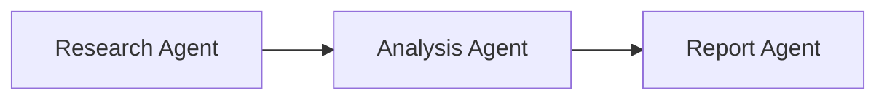
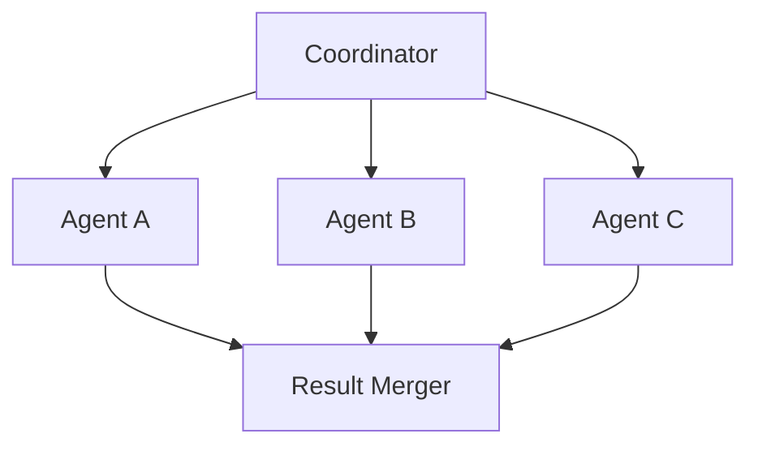
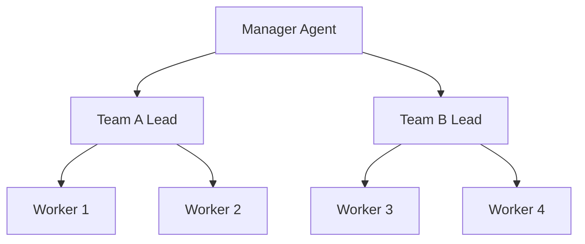

# Chapter 3: Multi-Agent Orchestration Patterns

*[Placeholder Content - This chapter will cover advanced multi-agent coordination]*

## Overview

This chapter explores sophisticated patterns for orchestrating multiple AI agents to solve complex problems that require diverse expertise and coordinated execution.

## Key Topics

### 3.1 Agent Coordination Models
*[Placeholder: Different approaches to agent coordination]*

### 3.2 Communication Protocols
*[Placeholder: How agents communicate and share information]*

### 3.3 Workflow Patterns
*[Placeholder: Sequential, parallel, and hybrid execution patterns]*

### 3.4 Conflict Resolution
*[Placeholder: Handling disagreements between agents]*

## Coordination Patterns

### Sequential Pipeline

*[Placeholder: When to use sequential processing]*

### Parallel Processing

*[Placeholder: When to use parallel coordination]*

### Hierarchical Organization

*[Placeholder: When to use hierarchical structures]*

## Implementation Strategies

### Agent Registry
```typescript
// Placeholder: Multi-agent registry
interface AgentRegistry {
  // Registry implementation will be added here
}
```

### Message Passing
*[Placeholder: Inter-agent communication mechanisms]*

### State Synchronization
*[Placeholder: Keeping agents in sync]*

## Use Cases

### Research Pipeline
*[Placeholder: Multi-stage research workflows]*

### Decision Support Systems
*[Placeholder: Collaborative decision making]*

### Content Generation Workflows
*[Placeholder: Multi-agent content creation]*

## Best Practices

*[Placeholder: Guidelines for effective multi-agent systems]*

### Error Handling
*[Placeholder: Graceful failure management]*

### Performance Optimization
*[Placeholder: Optimizing multi-agent performance]*

## Next Steps

*[Placeholder: Link to Chapter 4 - Case Studies]* 