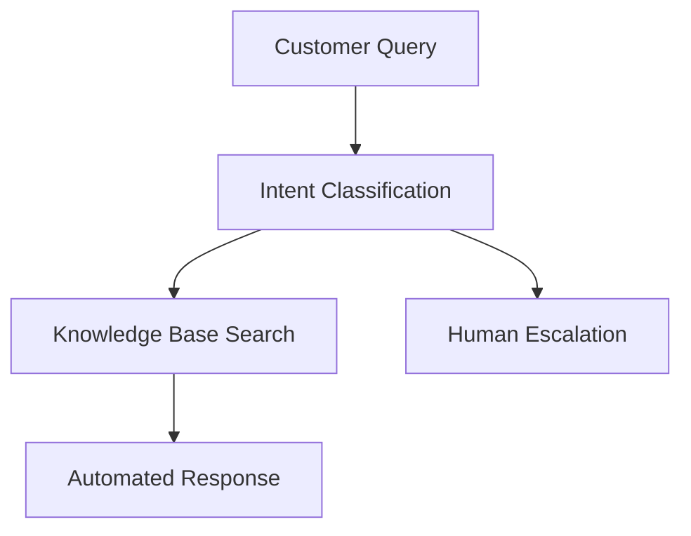
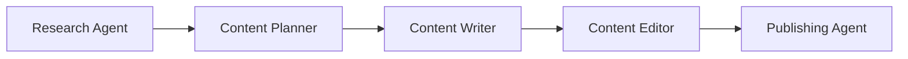

# Chapter 4: Real-World Case Studies

*[Placeholder Content - This chapter will analyze successful agent implementations]*

## Overview

This chapter presents detailed case studies of AI agents deployed in production environments, analyzing their architecture, performance, and lessons learned.

## Case Study Categories

### 4.1 Healthcare & Medical
*[Placeholder: Medical diagnostic and research agents]*

### 4.2 Customer Service & Support
*[Placeholder: Automated customer service implementations]*

### 4.3 Content & Marketing
*[Placeholder: Content generation and marketing automation]*

### 4.4 Data Analysis & Research
*[Placeholder: Research and analysis workflows]*

## Featured Case Studies

### Case Study 1: Medical Diagnostic Agent
*[Placeholder: Detailed analysis of diagnostic reasoning implementation]*

#### Architecture Overview
```yaml
# Placeholder: Agent configuration
agent_type: "diagnostic"
tools: ["search", "medical_db", "reasoning"]
determinism: "high"
```

#### Performance Metrics
| Metric | Value |
|--------|-------|
| Diagnostic Accuracy | *[Placeholder: 95%]* |
| Average Response Time | *[Placeholder: 2.3s]* |
| Cases Processed | *[Placeholder: 10,000+]* |

### Case Study 2: Customer Service Agent
*[Placeholder: Automated customer support implementation]*

#### Workflow Pattern


#### Key Metrics
- *[Placeholder: 85% resolution rate]*
- *[Placeholder: 40% cost reduction]*
- *[Placeholder: 4.2/5 customer satisfaction]*

### Case Study 3: Content Generation Agent
*[Placeholder: Multi-stage content creation workflow]*

#### Content Pipeline


#### Results
- *[Placeholder: 300% content output increase]*
- *[Placeholder: Maintained quality standards]*
- *[Placeholder: 60% time savings]*

## Implementation Patterns

### Common Architecture Patterns
*[Placeholder: Shared patterns across implementations]*

### Tool Integration Strategies
*[Placeholder: How different tools are combined effectively]*

### Error Handling Approaches
*[Placeholder: Production error management strategies]*

## Lessons Learned

### Technical Insights
*[Placeholder: Key technical learnings]*

### Operational Considerations
*[Placeholder: Production operation insights]*

### Performance Optimization
*[Placeholder: Optimization strategies that worked]*

## Future Considerations

*[Placeholder: Emerging trends and future directions]*

### Scaling Challenges
*[Placeholder: Challenges in scaling successful implementations]*

### Integration Opportunities
*[Placeholder: Opportunities for broader integration]*

## Conclusion

*[Placeholder: Summary of key insights from case studies]* 