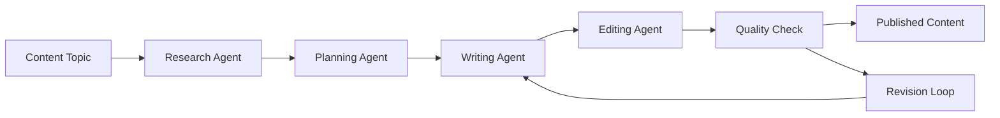

# Content Generation Agent

*[Placeholder Content - This template will demonstrate multi-stage content creation workflow]*

## Agent Overview

This multi-agent system orchestrates a complete content creation pipeline from research to publication, ensuring high-quality, well-researched content.

## How It Works

### Agent Roles
- **Research Agent**: *[Placeholder: Gathers information and sources]*
- **Planning Agent**: *[Placeholder: Creates content outline and structure]*
- **Writing Agent**: *[Placeholder: Generates the actual content]*
- **Editing Agent**: *[Placeholder: Reviews and refines content]*

### Content Pipeline


## Implementation

### Multi-Agent Configuration
```yaml
# Placeholder: Content generation system configuration
content_system:
  research_agent:
    type: "AgentNode"
    model: "gpt-4"
    tools: ["search", "fact_check", "source_validation"]
    determinism: "medium"
  
  planning_agent:
    type: "AgentNode"
    model: "gpt-4"
    tools: ["outline_generator", "structure_planner"]
    determinism: "high"
  
  writing_agent:
    type: "AgentNode"
    model: "gpt-4"
    tools: ["content_writer", "style_adapter"]
    determinism: "low"
  
  editing_agent:
    type: "AgentNode"
    model: "gpt-4"
    tools: ["grammar_check", "fact_verify", "style_review"]
    determinism: "high"
```

### Workflow Orchestration
```typescript
// Placeholder: Content generation workflow
class ContentGenerationWorkflow {
  // Workflow implementation will be added here
}
```

## Content Types Supported

### Blog Posts & Articles
- *[Placeholder: Long-form educational content]*
- *[Placeholder: News articles and updates]*
- *[Placeholder: Opinion pieces and analysis]*

### Marketing Content
- *[Placeholder: Product descriptions]*
- *[Placeholder: Email campaigns]*
- *[Placeholder: Social media posts]*

### Technical Documentation
- *[Placeholder: API documentation]*
- *[Placeholder: User guides]*
- *[Placeholder: Technical specifications]*

## Quality Assurance

### Research Validation
- *[Placeholder: Source credibility checks]*
- *[Placeholder: Fact verification process]*
- *[Placeholder: Citation management]*

### Content Quality Metrics
| Metric | Target | *[Placeholder]* |
|--------|--------|-----------------|
| Readability Score | >70 | *[Actual: TBD]* |
| Factual Accuracy | >95% | *[Actual: TBD]* |
| SEO Score | >80 | *[Actual: TBD]* |
| Originality | >90% | *[Actual: TBD]* |

### Editorial Standards
- *[Placeholder: Grammar and style guidelines]*
- *[Placeholder: Brand voice consistency]*
- *[Placeholder: Legal compliance checks]*

## Customization Options

### Style Configuration
```yaml
# Placeholder: Style configuration
style_settings:
  tone: "professional"
  audience: "technical"
  length: "medium"
  format: "blog_post"
```

### Domain Expertise
- *[Placeholder: Technology and software]*
- *[Placeholder: Healthcare and medical]*
- *[Placeholder: Finance and business]*
- *[Placeholder: Education and training]*

### Output Formats
- *[Placeholder: Markdown documents]*
- *[Placeholder: HTML web content]*
- *[Placeholder: PDF reports]*
- *[Placeholder: Social media formats]*

## Performance Metrics

### Production Metrics
- *[Placeholder: Content output volume]*
- *[Placeholder: Time to completion]*
- *[Placeholder: Quality consistency]*

### Engagement Metrics
- *[Placeholder: Reader engagement rates]*
- *[Placeholder: SEO performance]*
- *[Placeholder: Social sharing metrics]*

## Integration Points

### CMS Integration
*[Placeholder: WordPress, Contentful, Strapi connections]*

### SEO Tools
*[Placeholder: Keyword research and optimization]*

### Publishing Platforms
*[Placeholder: Blog platforms, social media, newsletters]*

## Testing & Validation

### Content Review Process
*[Placeholder: Human review workflows]*

### A/B Testing
*[Placeholder: Content performance testing]*

### Quality Benchmarks
*[Placeholder: Established quality standards]*

## Deployment

### Scalability Considerations
*[Placeholder: Handling high-volume content requests]*

### Resource Management
*[Placeholder: API usage and cost optimization]*

### Monitoring & Analytics
*[Placeholder: Performance tracking and optimization]* 