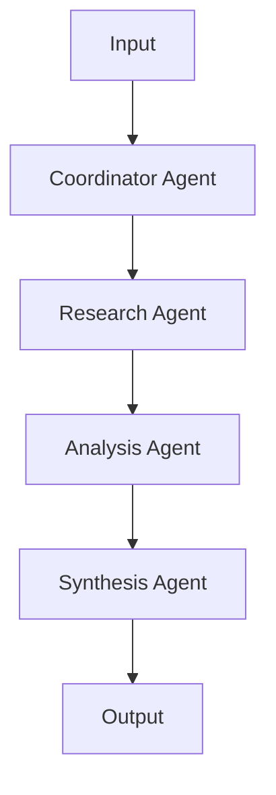
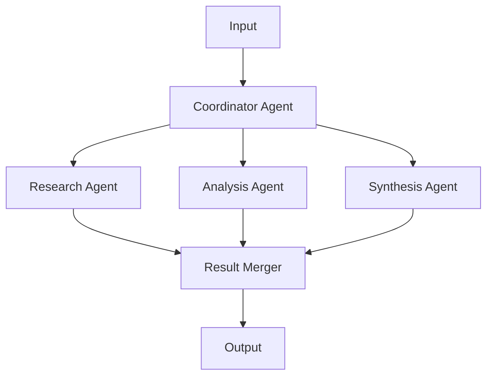

# Multi-Agent Orchestration Template

*[Placeholder Content - This template will demonstrate advanced multi-agent coordination patterns]*

## Architecture Overview

This template shows how to orchestrate multiple specialized agents working together to solve complex tasks requiring different expertise areas.

## Agent Definitions

### Primary Coordinator Agent
```yaml
# Placeholder: Coordinator configuration
coordinator:
  type: "AgentNode"
  role: "orchestrator"
  capabilities: ["task-routing", "result-synthesis"]
  determinism: "high"
```

### Specialized Worker Agents
```yaml
# Placeholder: Worker agent configurations
workers:
  research_agent:
    type: "AgentNode"
    role: "researcher"
    tools: ["search", "deep_research"]
    determinism: "medium"
  
  analysis_agent:
    type: "AgentNode"
    role: "analyst"
    tools: ["data_analysis", "visualization"]
    determinism: "high"
  
  synthesis_agent:
    type: "AgentNode"
    role: "synthesizer"
    tools: ["think", "reflect", "generate"]
    determinism: "low"
```

## Coordination Patterns

### Sequential Processing

*[Placeholder: When to use sequential coordination]*

### Parallel Processing

*[Placeholder: When to use parallel coordination]*

## Implementation

### 1. Agent Registry Setup
```typescript
// Placeholder: Multi-agent registry configuration
const agentRegistry = new PlaceholderRegistry({
  // Registry configuration will be added here
});
```

### 2. Communication Protocol
*[Placeholder: How agents communicate and share state]*

### 3. Task Routing Logic
*[Placeholder: How the coordinator decides which agent handles what]*

### 4. Result Aggregation
*[Placeholder: How results from multiple agents are combined]*

## Workflow Examples

### Complex Research Pipeline
*[Placeholder: Step-by-step example of multi-agent research]*

### Data Processing Workflow
*[Placeholder: Example of parallel data processing]*

## Error Handling & Recovery

*[Placeholder: How to handle failures in multi-agent systems]*

### Fallback Strategies
- *[Placeholder: Agent substitution]*
- *[Placeholder: Graceful degradation]*
- *[Placeholder: Retry mechanisms]*

## Performance Optimization

*[Placeholder: Best practices for multi-agent performance]* 