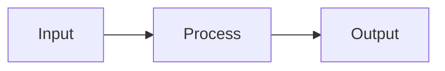
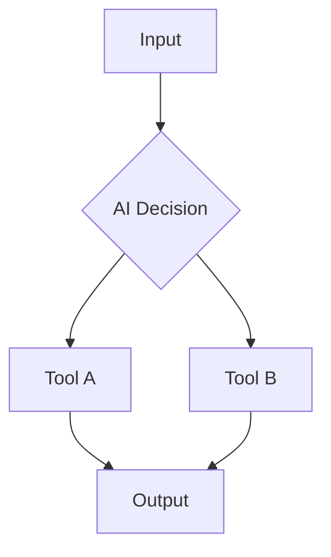

# Single Agent Workflow Template

*[Placeholder Content - This template will provide a blueprint for single-agent implementations]*

## Workflow Overview

This template demonstrates how to implement a single-agent workflow that balances **deterministic execution** with **creative AI capabilities**.

## Configuration

### Agent Setup
```yaml
# Placeholder: Agent configuration
agent:
  type: "AgentNode"
  model: "placeholder-model"
  determinism: "configurable"
  tools: 
    - "placeholder-tool-1"
    - "placeholder-tool-2"
```

### Environment Variables
```env
# Placeholder: Environment configuration
AGENT_API_KEY=placeholder_key
AGENT_MODEL=placeholder_model
DETERMINISM_LEVEL=balanced
```

## Implementation Steps

### 1. Initialize Agent
```typescript
// Placeholder: Agent initialization code
const agent = new PlaceholderAgent({
  // Configuration will be added here
});
```

### 2. Define Workflow Logic
*[Placeholder: Step-by-step workflow definition]*

### 3. Configure Tools
*[Placeholder: Tool integration and configuration]*

### 4. Set Determinism Level
*[Placeholder: How to control predictability vs creativity]*

## Workflow Patterns

### Pattern A: Deterministic Processing

*[Placeholder: When to use deterministic flows]*

### Pattern B: AI-Assisted Decision Making

*[Placeholder: When to use AI-driven flows]*

## Testing & Validation

*[Placeholder: How to test and validate the workflow]*

### Test Cases
- *[Placeholder: Test scenario 1]*
- *[Placeholder: Test scenario 2]*
- *[Placeholder: Test scenario 3]*

## Deployment

*[Placeholder: Deployment instructions and best practices]* 