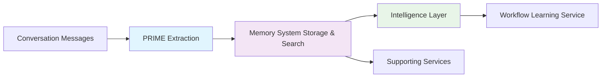
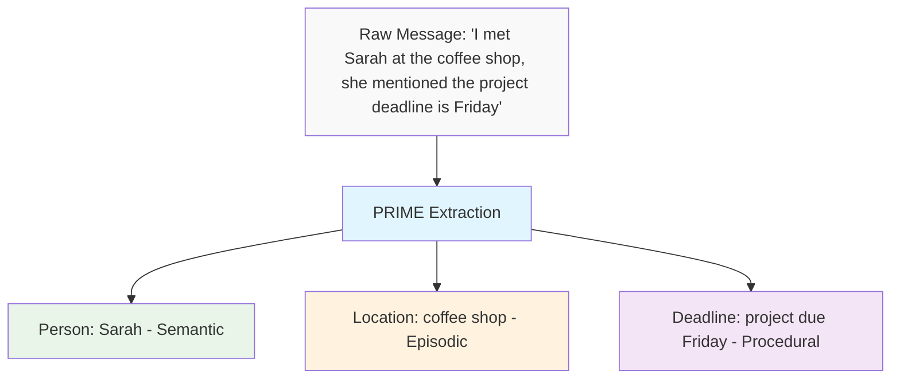
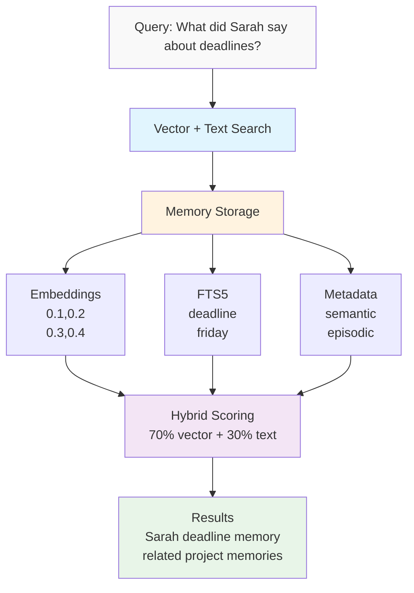
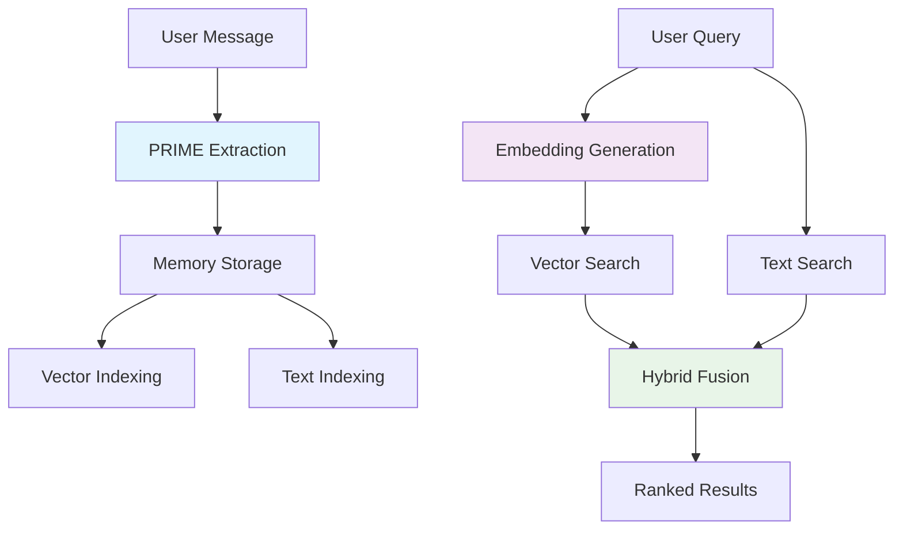
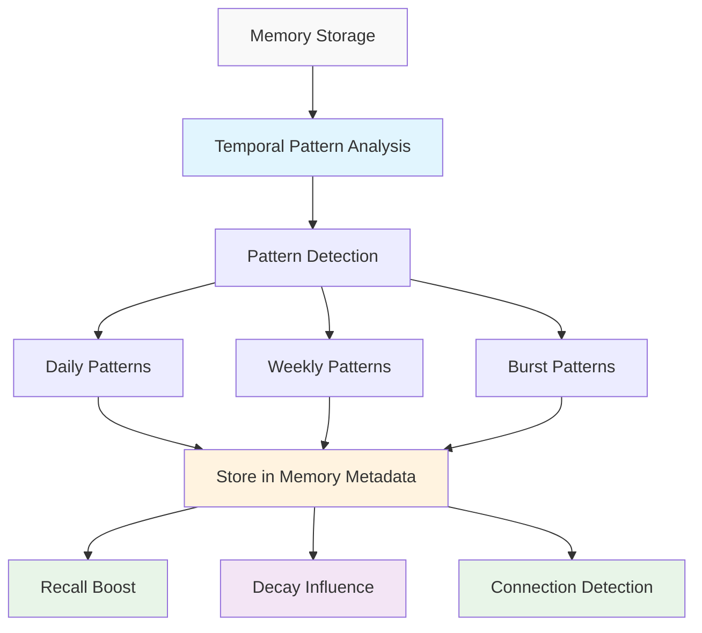

# AgentDock Memory Architecture Overview

## Complete Architecture



## PRIME: Intelligent Memory Extraction

**Purpose**: Transform conversations into structured memories



**Key Features**:
- Smart model selection (standard/advanced 2-tier)
- Rule-based extraction guidance
- Cost optimization with budget tracking
- Real-time message processing

## Memory System: Vector-First Storage & Retrieval

**Purpose**: Store, index, and retrieve memories efficiently



**Key Features**:
- Hybrid vector + text search
- Specialized memory adapters for PostgreSQL and SQLite
- Community-extensible adapters available for ChromaDB, Pinecone, and Qdrant
- Memory type specialization
- Performance: <50ms recall

## Architecture Flow



## Advanced Features

### PRIME Extraction
- **Rule-based guidance**: Natural language extraction rules
- **Tier optimization**: Auto-select model based on complexity
- **Cost intelligence**: Budget tracking with <$20/month for 100k operations

### Memory Retrieval (Enhanced)
- **Vector-first**: Semantic similarity using text-embedding-3-small
- **Hybrid search**: Combines vector (70%) + text (30%) scoring
- **Multi-adapter**: PostgreSQL ts_rank_cd + SQLite FTS5 BM25
- **Performance**: <50ms recall, >95% accuracy
- **Configurable hops**: 1-3 connection hops based on recall preset
- **Temporal boost**: Relevance boost for time-pattern matches
- **Evolution tracking**: Access events logged automatically

## Key Technical Differentiators

**Four-Layer Memory Architecture**: Unlike single-layer systems, AgentDock mirrors human cognition with working, episodic, semantic, and procedural memory types, each optimized for different information patterns and retrieval scenarios.

**PRIME Extraction Intelligence**: Intelligent 2-tier model selection with rule-based guidance reduces extraction costs by 60% while maintaining quality. Most systems use expensive models for all extractions.

**Hybrid Vector-Text Search**: Pure vector search fails on specialized terminology. Our research-validated 70/30 vector/text split prevents catastrophic failures while maintaining semantic understanding across domains.

**Memory Connection Graph**: SQL-based graph operations without dedicated graph databases. 5 research-backed connection types (similar, related, causes, part_of, opposite) with intelligent relationship traversal up to 3 hops deep.

**Progressive Enhancement Connection Discovery**: Tiered approach (embeddings → rules → LLM) reduces connection discovery costs by 65% while maintaining quality. Smart triage automatically classifies 65% of connections without LLM calls.

**Automatic Memory Consolidation**: Episodic-to-semantic conversion with merge, synthesize, and hierarchy strategies. Reduces storage while improving recall quality through intelligent memory lifecycle management.

**Lazy Memory Decay System**: On-demand decay calculation with configurable half-lives per memory type. 65-100% write avoidance through batch processing and access reinforcement patterns.

**Temporal Intelligence Integration**: Built-in pattern analysis, time-based memory relationships, and temporal influence on decay/recall. Statistical approach with optional LLM enhancement for behavioral insights.

**Multi-Adapter Architecture**: Single API works with PostgreSQL, SQLite, ChromaDB, Pinecone, and Qdrant without vendor lock-in. Managed service compatibility without database extensions.

**Cost-Optimized Operations**: Built-in budget tracking, smart triage, lazy calculations, and transparent cost reporting. Designed for production deployment with predictable costs under $20/month for 100k operations.

**Production-Ready Persistence**: SQL-based storage with optional vector enhancements. Transaction management, encryption support, and no complex graph database management requirements.

## Intelligence Layer: Advanced Memory Processing

**Purpose**: Enhance memory system with intelligent analysis and connections

### Memory Connections & Graph
- **MemoryConnectionManager**: Language-agnostic connection discovery
- **ConnectionGraph**: Graph operations for relationship traversal
- **5 core connection types**: similar, related, causes, part_of, opposite
- **Smart triage**: 40% auto-similar, 25% auto-related, 35% LLM classification
- **Progressive enhancement**: embeddings → user rules → LLM analysis

### Memory Consolidation
- **MemoryConsolidator**: Convert episodic → semantic memories
- **Strategies**: merge, synthesize, hierarchy
- **Language-agnostic**: Uses embeddings, optional LLM enhancement
- **Batch processing**: Efficient consolidation operations

### Temporal Pattern Analysis (Production Ready)
- **TemporalPatternAnalyzer**: Analyze memory access patterns
- **Pattern detection**: hourly, weekly, burst patterns
- **Activity clusters**: Identify periods of high memory activity
- **Statistical approach**: Optional LLM enhancement
- **Pattern storage**: Results stored in memory metadata as `temporalInsights`
- **Recall boost**: Daily patterns boost relevance during peak hours
- **Decay influence**: Burst patterns slow decay by 30%
- **Connection detection**: Temporal relationships between memories



### Memory Evolution Tracking (Basic Implementation)
- **Event logging**: Track memory lifecycle (created, accessed)
- **Storage**: Via `storage.evolution.trackEvent()` interface
- **Batched processing**: Efficient event handling
- **Sources**: BaseMemoryType, MemoryManager, RecallService
- **Note**: Basic events only - full PRD compliance pending

## Supporting Services

### Lazy Memory Decay
- **LazyDecayCalculator**: On-demand decay calculation
- **LazyDecayBatchProcessor**: Efficient batch updates
- **Access reinforcement**: Frequently used memories stay strong
- **Configurable half-lives**: Different decay rates per memory type
- **Archival threshold**: Low-resonance memory management

### Encryption Service
- **Column-level encryption**: PostgreSQL pgcrypto integration
- **Key rotation support**: Secure key management
- **Batch operations**: Performance-optimized encryption
- **Multiple providers**: ENV, AWS KMS, Vault support

### Cost Tracking
- **CostTracker**: Real-time operation cost monitoring
- **Budget enforcement**: Configurable spending limits
- **Cost breakdown**: Track by extractor type
- **Transparent reporting**: Clear cost visibility

### Transaction Management
- **MemoryTransaction**: Atomic operations with rollback
- **Consistency guarantee**: Multi-step operation safety
- **Scope helpers**: Automatic transaction management
- **Error recovery**: Graceful failure handling

## Workflow Learning Service (Built, Not Wired)

**Status**: Foundation implemented, awaiting integration with commercial product support

**Purpose**: Learn and suggest tool execution patterns

```typescript
// Located at: /orchestration/workflow-learning/WorkflowLearningService.ts
// PRD: Phase 1 ✅ COMPLETED - Service built
// PRD: Phase 2-3 🔧 PENDING - Integration with LLMOrchestrationService
```

**Key Features**:
- Pattern recognition for tool sequences
- Success tracking and confidence scoring
- Configurable learning thresholds
- Pattern merging and optimization
- Storage via procedural memory type

## Summary

**PRIME**: Intelligent extraction from conversations  
**Memory System**: Fast, accurate memory retrieval  
**Intelligence Layer**: Connections, consolidation, pattern analysis  
**Supporting Services**: Encryption, transactions, cost tracking, decay  
**Workflow Learning**: Built foundation, awaiting commercial integration  

**Together**: Complete memory pipeline from raw text to connected knowledge, enabling **Conversational RAG** through agent runtime memory injection

AgentDock provides clean architectural separation with no content duplication across memory types while maintaining production-ready performance.

## Related Documentation

- [Memory System README](./README.md) - Getting started with the memory system
- [Memory Connections](./memory-connections.md) - Detailed connection system explanation
- [Graph Architecture](./graph-architecture.md) - Technical graph implementation
- [Conversational RAG Guide](./retrieval-augmented-generation.md) - RAG implementation details
- [Complete Configuration Guide](./complete-configuration-guide.md) - Configuration examples