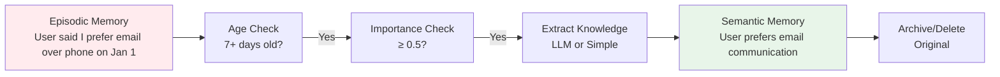
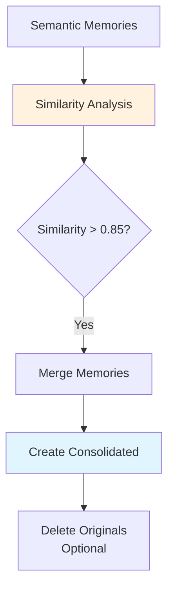

# Memory Consolidation Guide

Memory consolidation in AgentDock is an intelligent optimization system that prevents memory bloat while improving knowledge quality through automatic conversion, deduplication, and synthesis.

## What is Memory Consolidation?

Memory consolidation transforms raw memories into refined knowledge through three key processes:

1. **Episodic → Semantic Conversion**: Converts time-specific experiences into general knowledge
2. **Memory Deduplication**: Finds and merges similar memories to reduce redundancy
3. **Hierarchical Abstraction**: Creates higher-level concepts from detailed memories

This mirrors how human memory works - we don't remember every detail of every experience, but we extract patterns and knowledge that serve us better over time.

## Why Memory Consolidation Matters

Without consolidation, memory systems face critical challenges:

- **Memory Bloat**: Storing every interaction leads to exponential growth
- **Redundancy**: Similar information stored multiple times
- **Poor Recall**: Too many memories make finding relevant ones harder
- **No Learning**: Raw events don't become actionable knowledge

Consolidation solves these by creating a more efficient, intelligent memory structure.

## Resource Usage

### What Uses Server Resources Only
- Database queries
- CPU processing for comparisons
- Memory allocation
- Text concatenation

### What Costs Extra Money
- LLM API calls (OpenAI)
- Cloud embedding services
- External API usage

## How Consolidation Works

### 1. Episodic to Semantic Conversion

After a configurable age threshold (default: 7 days), important episodic memories are converted to semantic knowledge:



**Example Conversion:**
```typescript
// Before (Episodic)
{
  type: 'episodic',
  content: 'During our meeting on Monday, the client mentioned they always check email first thing in the morning but rarely answer phone calls before noon',
  timestamp: '2024-01-01T10:30:00Z',
  importance: 0.7
}

// After (Semantic)
{
  type: 'semantic',
  content: 'Client prefers email communication and checks it first thing in the morning. Avoids phone calls before noon.',
  importance: 0.8, // Boosted by 0.1
  metadata: {
    convertedFrom: 'episodic-123',
    conversionDate: '2024-01-08T00:00:00Z'
  }
}
```

### 2. Memory Deduplication

The consolidator identifies and merges similar memories using multiple similarity metrics:



**Similarity Metrics:**
- **Vector Embedding Similarity**: Semantic meaning comparison
- **Keyword Overlap**: Shared important terms
- **Metadata Similarity**: Same categories, entities, or topics
- **Temporal Proximity**: Memories created around the same time
- **Temporal Pattern Matching**: Memories from similar activity patterns (daily routines, burst periods)

**Example Merge:**
```typescript
// Memory 1
"User prefers Python for data science projects"

// Memory 2  
"User likes using Python for machine learning"

// Memory 3
"User mentioned Python is their go-to for analytics"

// Consolidated Result
"User primarily uses Python for data science, machine learning, and analytics projects"
```

### 3. Consolidation Strategies

The system supports multiple strategies that can be combined:

| Strategy | Description | Use Case | Preserves Detail |
|----------|-------------|----------|------------------|
| **Merge** | Simple concatenation of similar content | High similarity (>0.9) | Low |
| **Synthesize** | LLM creates new summary from multiple | Medium similarity (0.7-0.9) | Medium |
| **Abstract** | Extract high-level patterns | Pattern recognition | Low |
| **Hierarchy** | Create parent-child relationships | Categorical organization | High |

### Temporal Pattern Integration

Consolidation now considers temporal patterns when grouping memories:

```typescript
// Memories from the same burst period are prioritized for consolidation
const burstMemories = memories.filter(m => 
  m.metadata.temporalInsights?.patterns?.some(p => p.type === 'burst')
);

// Daily patterns inform consolidation timing
const dailyPatterns = getTemporalPatterns(memories, 'daily');
if (dailyPatterns.length > 0) {
  // Schedule consolidation during low-activity periods
  scheduleConsolidation(offPeakHours);
}
```

**Benefits:**
- **Burst Memory Consolidation**: Memories from intense activity periods are consolidated together
- **Pattern-Aware Grouping**: Similar temporal patterns help identify related memories
- **Optimal Timing**: Consolidation runs during low-activity periods for better performance

## Configuration

### Basic Configuration

```typescript
const memoryConfig = {
  consolidation: {
    enabled: true,
    similarityThreshold: 0.85,        // Minimum similarity for merging
    maxAge: 7 * 24 * 60 * 60 * 1000, // 7 days in milliseconds
    preserveOriginals: false,         // Delete after consolidation
    strategies: ['merge', 'synthesize'],
    batchSize: 20                     // Process in batches
  }
};
```

### Advanced Configuration with LLM

```typescript
const advancedConfig = {
  consolidation: {
    enabled: true,
    similarityThreshold: 0.85,
    maxAge: 7 * 24 * 60 * 60 * 1000,
    preserveOriginals: true,          // Keep originals for safety
    strategies: ['merge', 'synthesize', 'abstract'],
    batchSize: 20,
    enableLLMSummarization: true,     // Use AI for better synthesis
    llmConfig: {
      provider: 'openai',
      model: 'gpt-4.1-mini',          // Cost-effective model
      maxTokensPerSummary: 200,
      temperature: 0.3,               // Low for consistency
      costPerToken: 0.0000002
    }
  }
};
```

## Safety and Balance

### Preventing Over-Consolidation

The system includes multiple safeguards:

1. **Time Delays**: Only consolidate memories older than `maxAge`
2. **Importance Threshold**: Only memories with importance ≥ 0.5
3. **Confidence Scores**: Skip low-confidence consolidations
4. **Batch Limits**: Process small batches to prevent runaway operations
5. **Cost Controls**: Monthly budget limits for LLM usage

### Transaction Safety

All consolidation operations are atomic:

```typescript
try {
  // 1. Create consolidated memory
  const consolidated = await createConsolidated(memories);
  
  // 2. Store successfully
  await storage.setMemory(consolidated);
  
  // 3. Only then delete originals (if configured)
  if (!preserveOriginals) {
    await storage.deleteMemories(originals);
  }
} catch (error) {
  // Originals remain untouched on any failure
}
```

## Cost Management

### LLM Usage Optimization

The consolidator intelligently manages LLM usage:

```typescript
// Skip LLM if embeddings are very similar
if (embeddingSimilarity > 0.9) {
  return simpleTextMerge(memories); // No API calls, but uses CPU
}

// Cost tracking
if (monthlySpend + estimatedCost > monthlyBudget) {
  return simpleTextMerge(memories); // Fallback to local compute only
}

// Use LLM only for complex synthesis
return llmSynthesize(memories);
```

### Cost Configuration

```typescript
costControl: {
  monthlyBudget: 50.00,              // $50/month limit
  preferEmbeddingWhenSimilar: true,  // Skip LLM for high similarity
  maxLLMCallsPerBatch: 5,            // Limit per batch
  trackTokenUsage: true              // Monitor consumption
}
```

## Best Practices

### 1. Start Conservative

Begin with high thresholds and preservation:

```typescript
{
  similarityThreshold: 0.9,  // Very similar only
  preserveOriginals: true,   // Keep everything initially
  strategies: ['merge'],     // Simple strategy first
  enableLLMSummarization: false
}
```

### 2. Monitor and Adjust

Track consolidation metrics:
- Number of memories consolidated
- Storage space saved
- Recall accuracy changes
- User feedback on missing information

### 3. Schedule Wisely

Run consolidation during low-activity periods:
- Nightly batch jobs
- After user sessions end
- During maintenance windows

### 4. Test Configurations

Test consolidation settings in development:
```typescript
// Aggressive for testing
const testConfig = {
  maxAge: 1 * 24 * 60 * 60 * 1000, // 1 day
  similarityThreshold: 0.7,         // Lower threshold
  preserveOriginals: false          // Delete originals
};
```

## Performance Considerations

### Processing Time

- **Similarity calculation**: ~5ms per memory pair
- **LLM synthesis**: 500-2000ms per consolidation
- **Batch of 20 memories**: 5-30 seconds total

### Storage Impact

Typical consolidation ratios:
- **Episodic → Semantic**: 3:1 reduction
- **Deduplication**: 2:1 to 5:1 reduction
- **Overall**: 60-80% storage reduction

### Memory Quality

Consolidation improves retrieval:
- **Faster searches**: Fewer memories to scan
- **Better relevance**: Consolidated knowledge matches queries better
- **Reduced noise**: Eliminates redundant information

## Integration with Memory System

The consolidator integrates seamlessly with other memory components:

1. **With Decay System**: Important memories survive, trivial ones fade
2. **With Connections**: Consolidated memories maintain relationships
3. **With Search**: Better recall through refined knowledge
4. **With PRIME**: Extraction rules guide what becomes semantic

## Troubleshooting

### Common Issues

1. **Too Much Consolidation**
   - Increase `similarityThreshold`
   - Enable `preserveOriginals`
   - Reduce `batchSize`

2. **Not Enough Consolidation**
   - Decrease `maxAge` requirement
   - Lower `similarityThreshold`
   - Add more strategies

3. **High LLM Costs**
   - Reduce `maxLLMCallsPerBatch`
   - Lower `monthlyBudget`
   - Use simpler model

## Summary

Memory consolidation is a powerful feature that:
- Prevents memory bloat through intelligent optimization
- Improves knowledge quality through synthesis
- Reduces costs through deduplication
- Maintains system performance at scale

When configured properly, it creates a self-organizing memory system that gets better over time - just like human memory.