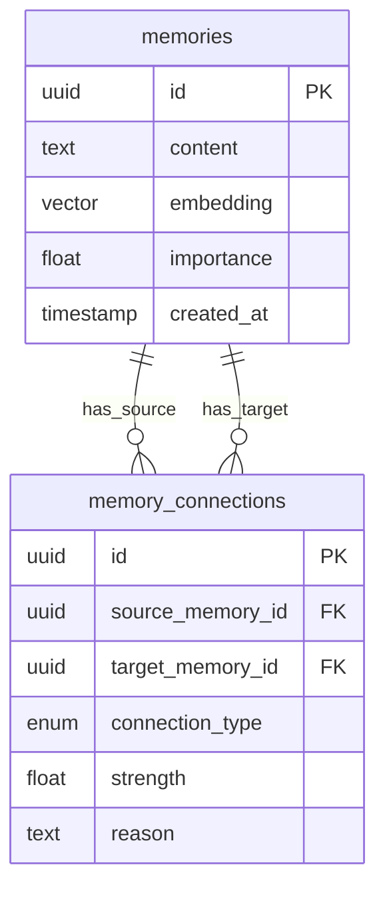
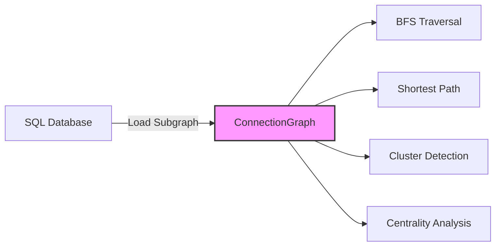
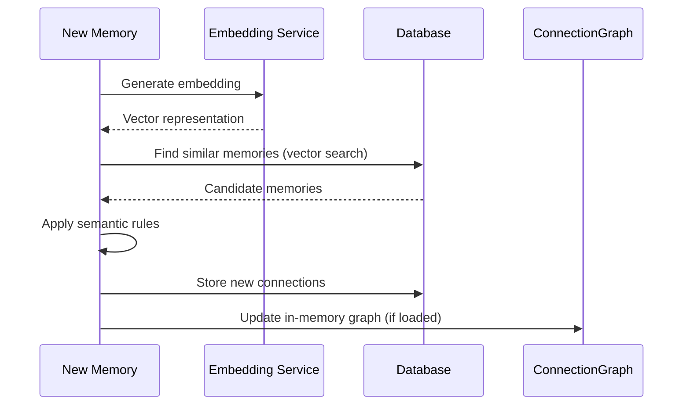

# Memory Graph Architecture

> **Technical documentation for developers and architects**

This document provides the technical rationale and implementation details behind AgentDock's decision to use a hybrid SQL + in-memory graph approach instead of a dedicated graph database.

## Executive Summary

AgentDock implements a hybrid approach to memory connections, combining relational database persistence with in-memory graph operations. This architecture provides graph-like functionality while maintaining the operational simplicity of traditional databases.

## Technical Overview

Rather than using a dedicated graph database (Neo4j, ArangoDB, etc.), AgentDock stores memory connections in relational tables and performs graph operations through a combination of SQL recursive CTEs and in-memory algorithms. This approach balances performance, reliability, and operational complexity.

## Why We Chose SQL Over Graph Databases: Technical Analysis

### 1. Scale Reality Check

**Agent Memory Characteristics:**
```
- Nodes per agent: 100-10,000 memories
- Edges per node: 2-10 connections average
- Graph diameter: 3-5 hops typical
- Cross-agent queries: None (isolated graphs)
- Update frequency: ~1-10 Hz per agent
```

**Conclusion**: These are tiny graphs by graph database standards. Facebook's social graph has billions of nodes with thousands of edges each. Our use case is 6-7 orders of magnitude smaller.

### 2. Query Pattern Analysis

**Our Actual Query Needs:**
- 90% queries: Direct connections (1 hop)
- 9% queries: 2-3 hop traversals
- 1% queries: Complex patterns
- 0% queries: Global graph algorithms

**SQL Performance for These Patterns:**
- 1 hop: Native JOIN - extremely fast
- 2-3 hops: Recursive CTE - still fast
- Complex: Load subgraph to memory - acceptable

### 3. Operational Cost-Benefit

**Graph Database Hidden Costs:**
- Separate infrastructure management
- Specialized backup/restore procedures
- Limited cloud provider support
- Requires graph query expertise
- Complex high availability setup
- Vendor lock-in concerns

**SQL Advantages We Leverage:**
- Runs on existing PostgreSQL/SQLite
- Standard backup/restore tools
- Available on all cloud providers
- SQL expertise is ubiquitous
- Built-in HA solutions
- No vendor lock-in

### 4. Feature Requirements Analysis

**What We Actually Need:**
- Store connections with metadata (type, strength, reason)
- Traverse relationships 1-3 levels deep
- Combine with vector similarity search
- Maintain ACID consistency
- Handle 100-10,000 memories per agent
- Support user-isolated graphs

**What We Don't Need:**
- Complex graph algorithms (PageRank, community detection)
- Massive parallel graph processing
- Cross-user graph traversal
- Real-time graph updates at scale
- Billions of nodes/edges
- Sub-millisecond traversal of deep graphs

## Architecture Components

### 1. Relational Storage Layer

Memory connections are persisted in standard relational tables:



**Actual SQL Schema:**

```sql
CREATE TABLE memory_connections (
    id UUID PRIMARY KEY,
    source_memory_id UUID REFERENCES memories(id),
    target_memory_id UUID REFERENCES memories(id),
    connection_type ENUM('similar', 'related', 'causes', 'part_of', 'opposite'),
    strength FLOAT,        -- 0.0 to 1.0
    reason TEXT,          -- Why this connection exists
    created_at TIMESTAMP,
    
    -- Ensure unique connections
    UNIQUE(source_memory_id, target_memory_id),
    
    -- Indexes for fast lookups
    INDEX idx_source (source_memory_id, strength DESC),
    INDEX idx_target (target_memory_id, strength DESC)
);
```

### 2. SQL-Based Graph Traversal

For simple graph operations, we use SQL recursive Common Table Expressions (CTEs):

**Direct Connection Query:**
```sql
-- Find direct connections (1 hop)
SELECT m.* FROM memories m
JOIN memory_connections mc ON m.id = mc.target_memory_id
WHERE mc.source_memory_id = :memory_id
  AND mc.strength > 0.5
ORDER BY mc.strength DESC;
```

**Multi-Hop Traversal:**
```sql
-- Find all memories connected within 3 hops
WITH RECURSIVE connected_memories AS (
    -- Base case: direct connections
    SELECT 
        target_memory_id as memory_id,
        1 as depth,
        strength
    FROM memory_connections 
    WHERE source_memory_id = :starting_memory_id
    
    UNION ALL
    
    -- Recursive case: connections of connections
    SELECT 
        mc.target_memory_id,
        cm.depth + 1,
        cm.strength * mc.strength as combined_strength
    FROM memory_connections mc
    JOIN connected_memories cm ON mc.source_memory_id = cm.memory_id
    WHERE cm.depth < 3
)
SELECT DISTINCT * FROM connected_memories
ORDER BY combined_strength DESC;
```

**Alternative Multi-Hop Query (from original implementation):**
```sql
-- Multi-hop traversal using recursive CTE
WITH RECURSIVE connected AS (
    SELECT target_memory_id, strength, 1 as depth
    FROM memory_connections
    WHERE source_memory_id = :memory_id
    
    UNION ALL
    
    SELECT mc.target_memory_id, c.strength * mc.strength, c.depth + 1
    FROM memory_connections mc
    JOIN connected c ON mc.source_memory_id = c.target_memory_id
    WHERE c.depth < 3
)
SELECT * FROM connected WHERE strength > 0.3;
```

### 3. In-Memory Graph Engine

For complex graph algorithms, we load relevant subgraphs into memory:



**ConnectionGraph Implementation:**

```typescript
class ConnectionGraph {
    // Basic operations
    addNode(id: string, metadata: any): void
    addEdge(from: string, to: string, type: string, strength: number): void
    
    // Path finding
    findPath(from: string, to: string): string[]
    getConnectionPath(sourceId: string, targetId: string): string[]
    
    // Graph analysis
    detectCommunity(nodeId: string): Set<string>
    getMemoryClusters(minSize: number): string[][]
    
    // Centrality metrics
    calculateCentrality(nodeId: string): number
    getCentralMemories(limit: number): Array<{memoryId: string; centrality: number}>
    
    // NEW: Pattern analysis integration
    analyzeGraphPatterns(memoryId: string): MemoryConnection[]
}
```

This in-memory graph now actively enhances connection discovery through:
- **2-hop traversal**: Finding indirect relationships via `analyzeGraphPatterns()`
- **Community detection**: Identifying memory clusters with `detectCommunity()`
- **Centrality analysis**: Highlighting important memories using degree centrality
- **Path finding**: Discovering connection paths between any two memories

This in-memory graph is used when:
- Query depth exceeds 3 hops
- Complex pattern matching is required
- Graph algorithms (centrality, clustering) are needed
- Performance optimization for frequent queries

## Performance Characteristics

### Operation Performance Comparison

| Operation | SQL Approach | Graph DB | Our Hybrid |
|-----------|-------------|----------|------------|
| Single connection lookup | <10ms | <5ms | <10ms |
| 2-hop traversal | <50ms | <20ms | <50ms |
| 5-hop traversal | 200-500ms | <50ms | <100ms* |
| Pattern matching | 100-300ms | <50ms | <150ms* |
| Aggregations | <50ms | 100-200ms | <50ms |
| Bulk inserts | <100ms | 200-500ms | <100ms |

*Using in-memory graph for complex operations

### Scalability Profile

- **Optimal range**: 100-10,000 memories per agent
- **Connection density**: 2-10 connections per memory
- **Query depth**: Best performance at 1-3 hops
- **Concurrent operations**: Scales with database connection pool

## Advantages of This Approach

### 1. Operational Simplicity
- No additional database infrastructure required
- Works with managed database services (RDS, Supabase)
- Standard SQL backup and recovery procedures
- Familiar query language for debugging

### 2. Data Consistency
- ACID transactions for all operations
- Foreign key constraints ensure referential integrity
- No eventual consistency challenges
- Atomic connection updates

### 3. Hybrid Query Capabilities
- Combine vector similarity with graph traversal
- Efficient aggregations and reporting
- Flexible query patterns
- Full-text search integration

### 4. Cost Efficiency
- No specialized graph database licensing
- Runs on existing PostgreSQL/SQLite infrastructure
- Lower operational overhead
- Simpler monitoring and alerting

## Limitations and Mitigations

### 1. Deep Traversal Performance

**Limitation**: Performance degrades exponentially beyond 3-4 hops.

**Mitigation**: 
- Load subgraphs into memory for deep analysis
- Limit default traversal depth
- Use materialized views for common patterns

### 2. Complex Pattern Matching

**Limitation**: Complex graph patterns require multiple queries or in-memory processing.

**Mitigation**:
- Pre-compute common patterns
- Use in-memory graph for complex algorithms
- Cache frequently accessed subgraphs

### 3. Scale Limitations

**Limitation**: Not optimal for millions of densely connected nodes.

**Mitigation**:
- Partition by user/agent
- Archive old connections
- Use connection strength thresholds

## Implementation Details

### Connection Discovery Process



### Query Optimization Strategies

1. **Indexed Foreign Keys**
   ```sql
   CREATE INDEX idx_connections_source 
     ON memory_connections(source_memory_id, strength DESC);
   CREATE INDEX idx_connections_target 
     ON memory_connections(target_memory_id, strength DESC);
   ```

2. **Materialized Paths** (for frequently accessed routes)
   ```sql
   CREATE MATERIALIZED VIEW memory_paths AS
   WITH RECURSIVE paths AS (...)
   SELECT * FROM paths;
   ```

3. **Connection Limits**
   - Maximum connections per memory: 50
   - Default traversal depth: 3
   - Similarity threshold: 0.7

## Best Practices

### 1. Connection Management
- Limit connections per memory to maintain performance
- Use connection strength to filter weak relationships
- Periodically prune low-value connections

### 2. Query Patterns
- Prefer shallow traversals (1-3 hops)
- Use in-memory graph for complex algorithms
- Cache frequently accessed subgraphs

### 3. Scaling Strategies
- Partition large graphs by user or time period
- Use read replicas for graph analysis
- Consider graph sampling for very large datasets

## Comparison with Graph Databases

| Aspect | SQL + In-Memory | Graph Database |
|--------|-----------------|----------------|
| **Setup Complexity** | Low - uses existing DB | High - new infrastructure |
| **Operational Cost** | Low - standard SQL tools | High - specialized skills |
| **Simple Queries** | Fast (<50ms) | Very Fast (<20ms) |
| **Complex Queries** | Moderate (100-500ms) | Fast (<100ms) |
| **ACID Compliance** | Full | Varies by vendor |
| **Hybrid Search** | Native | Requires integration |
| **Backup/Recovery** | Standard SQL | Vendor-specific |
| **Cloud Support** | All major providers | Limited options |

## Real-World Benefits

### Pragmatic Advantages

Our hybrid approach delivers concrete benefits for production deployments:

1. **Simple Operations**
   - Works with existing PostgreSQL/SQLite databases
   - No new infrastructure to learn or manage
   - Standard SQL tools and monitoring

2. **Excellent Performance**
   - Optimized for typical agent workloads (100-10,000 memories)
   - Sub-100ms response times for common queries
   - Efficient batch operations

3. **Flexible Querying**
   - Combine vector search with graph traversal in single queries
   - Rich SQL ecosystem for analytics and reporting
   - Easy integration with existing data pipelines

4. **Low Operational Overhead**
   - Use familiar backup/restore procedures
   - Deploy on any managed database service (RDS, Supabase, etc.)
   - No specialized expertise required

## Conclusion

AgentDock's hybrid SQL + in-memory graph architecture provides an effective solution for agent memory systems. While it may not match the raw performance of dedicated graph databases for complex traversals, it offers significant advantages in operational simplicity, data consistency, and integration with existing infrastructure.

This pragmatic approach delivers the benefits of connected knowledge while maintaining the simplicity and reliability that production systems require.

### Best Suited For:
- Agent systems with moderate graph complexity (100-10,000 memories)
- Teams prioritizing operational simplicity
- Applications requiring hybrid vector + graph search
- Deployments on managed database services
- Organizations with existing SQL infrastructure

### Not Recommended For:
- Social networks with billions of users
- Real-time graph analytics at massive scale
- Applications requiring complex graph algorithms
- Systems with dense graphs (>100 connections per node)

For most agent memory use cases, this architecture provides the right balance of functionality, performance, and maintainability.

## Related Documentation

- **[Memory Connections](./memory-connections.md)** - Complete guide to connection discovery and configuration using this SQL + graph architecture
- **[Research Foundations](./research-foundations.md)** - Cognitive science principles behind memory connection types
- **[Complete Configuration Guide](./complete-configuration-guide.md)** - Environment variables and production settings