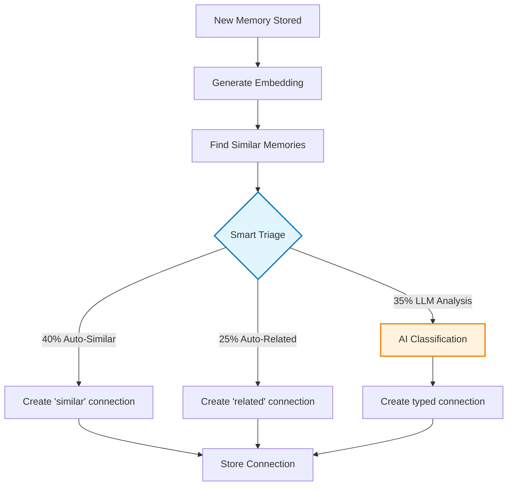

# Memory Connections

AgentDock's memory connection system automatically discovers relationships between memories, enabling agents to understand context and provide more relevant responses. The system uses cost-optimized smart triage for 65% cost reduction.

## Quick Overview (TLDR)

Most AI systems store information in isolation. AgentDock automatically discovers five types of relationships between memories based on established knowledge representation principles:

- **Similar:** Related semantic content ("pasta recipe" ↔ "Italian cooking")
- **Causal:** Cause-and-effect relationships ("error occurred" → "bug fix applied")  
- **Related:** General associations ("React learning" ↔ "JavaScript notes")
- **Part Of:** Hierarchical relationships ("login system" → "authentication project")
- **Opposite:** Conflicting information ("prefers dark mode" ↔ "prefers light mode")

> **Theoretical Background:** These connection types are informed by cognitive science and semantic network theory. For theoretical foundations and research citations, see [Research Foundations](./research-foundations.md).

**Default behavior:** Connections work automatically with zero configuration. System uses smart triage for cost optimization.

## How Connection Discovery Works

### Smart Triage System

The system uses a 2-tier approach with automatic cost optimization:



**Cost Optimization:**
- **65% FREE:** Auto-classified based on similarity thresholds
- **35% PAID:** Complex relationships use AI analysis
- **Result:** ~65% cost reduction vs. analyzing every connection

### Connection Types in Action

| Type | Example User Input | Agent Response |
|------|-------------------|----------------|
| Similar | "I need to cook dinner" | "You mentioned that pasta recipe last week, and you have Italian herbs." |
| Causal | "My code isn't working" | "Last time this error occurred, it was due to a dependency conflict." |
| Part Of | "Working on the login system" | "That's part of your authentication project. Here's the related documentation." |
| Opposite | "I prefer dark mode" | "Previously you mentioned preferring light mode. Has this changed?" |
| Related | "Tell me about React" | "You've been learning JavaScript and mentioned building web applications." |

## Configuration

### Default (Recommended)
```typescript
const memory = await createMemorySystem();
// Smart triage enabled automatically
```

### Environment Variables
```bash
# Force high-quality models for all connections
CONNECTION_ALWAYS_ADVANCED=true

# Use specific model for connections  
CONNECTION_MODEL=gpt-4.1

# Tune smart triage thresholds
CONNECTION_AUTO_SIMILAR=0.8     # 40% auto-similar (FREE)
CONNECTION_AUTO_RELATED=0.6     # 25% auto-related (FREE)
CONNECTION_LLM_REQUIRED=0.3     # 35% LLM analysis (PAID)
```

### Disable Connections
```typescript
const memory = await createMemorySystem({
  overrides: {
    intelligence: {
      connectionDetection: { enabled: false }
    }
  }
});
```

### Advanced Configuration
```typescript
const memory = await createMemorySystem({
  overrides: {
    intelligence: {
        connectionDetection: {
                enabled: true,
        enhancedModel: 'gpt-4.1',     // Use better model for complex analysis
        maxCandidates: 20,            // Limit comparison candidates  
        batchSize: 10,                // Batch LLM calls for efficiency
        temperature: 0.2,             // Low temperature for consistency
        
        // Smart triage thresholds
        thresholds: {
          autoSimilar: 0.8,           // Similarity >0.8 = auto "similar"
          autoRelated: 0.6,           // Similarity >0.6 = auto "related"  
          llmRequired: 0.3            // Similarity >0.3 = needs LLM
            }
      }
    }
  }
});
```

## Technical Implementation

### Architecture

AgentDock uses a **hybrid SQL + in-memory graph approach** that provides graph functionality without requiring a separate graph database:

- **Storage:** PostgreSQL/SQLite with connection tables
- **Performance:** Optimized for 100-10,000 memories per agent
- **Queries:** Standard SQL with smart caching for complex traversals
- **Cost:** No specialized database licensing

> **Architecture Deep Dive:** For complete technical details on why we chose SQL over dedicated graph databases, performance comparisons, and implementation decisions, see [Graph Architecture](./graph-architecture.md).

### Performance Characteristics

| Operation | Latency | Scale |
|-----------|---------|-------|
| Connection discovery | ~50ms | 50-100 candidates |
| Direct connections | <10ms | Unlimited |
| 2-hop traversal | <50ms | Best performance |
| 3-hop traversal | <100ms | Recommended limit |

### Smart Triage Thresholds

The system uses embedding similarity scores to automatically classify connections:

```typescript
// Similarity ranges and automatic classification
if (similarity > 0.8) {
  connectionType = 'similar';     // 40% of connections (FREE)
} else if (similarity > 0.6) {
  connectionType = 'related';     // 25% of connections (FREE)  
} else if (similarity > 0.3) {
  // Use LLM for complex analysis // 35% of connections (PAID)
  connectionType = await llm.classify(memory1, memory2);
}
```

### Connection Storage

Connections are stored as database records with metadata:

```sql
CREATE TABLE memory_connections (
  id UUID PRIMARY KEY,
  source_memory_id UUID NOT NULL,
  target_memory_id UUID NOT NULL,
  connection_type TEXT NOT NULL,  -- similar|related|causes|part_of|opposite
  confidence FLOAT NOT NULL,      -- 0.0 to 1.0
  reasoning TEXT,                 -- Optional explanation
  created_at TIMESTAMP DEFAULT NOW(),
  user_id TEXT NOT NULL          -- Security isolation
);
```

### Graph Operations

The system provides graph-like operations through SQL and in-memory processing:

```typescript
// Find connected memories
const connected = await memory.findConnectedMemories(userId, memoryId, depth: 2);

// Get memory clusters  
const clusters = await memory.getMemoryClusters(minSize: 3);

// Get central memories (highly connected)
const central = await memory.getCentralMemories(limit: 10);

// Find path between memories
const path = await memory.getConnectionPath(sourceId, targetId);
```

## Cost & Performance Optimization

### Smart Triage Benefits
- **Cost reduction:** 65% fewer LLM calls
- **Speed improvement:** Instant classification for 65% of connections
- **Quality maintained:** AI analysis for complex relationships

### Tuning Guidelines
- **High accuracy:** Lower thresholds (more LLM usage, higher cost)
- **High speed:** Higher thresholds (more auto-classification, lower cost)
- **Balanced:** Default thresholds provide good accuracy/cost balance

### Production Recommendations
```bash
# Production environment variables
CONNECTION_AUTO_SIMILAR=0.8       # Conservative threshold
CONNECTION_AUTO_RELATED=0.6       # Balanced threshold  
CONNECTION_ENHANCED_MODEL=gpt-4.1  # Quality model for complex cases
CONNECTION_PREFER_QUALITY=true    # Bias toward accuracy in production
```

## Integration with Recall

Memory connections enhance recall by providing related context:

```typescript
// Recall with connection context
const results = await memory.recall(userId, 'user preferences', {
  useConnections: true,          // Include connected memories
  connectionHops: 2,             // Traverse 2 levels deep
  connectionTypes: ['similar', 'related'], // Filter connection types
  boostCentralMemories: true     // Prioritize highly-connected memories
});
```

Connected memories appear in recall results with relationship context, enabling agents to provide more contextual and relevant responses.

## Temporal Pattern Integration {#temporal-pattern-integration}

The connection system now integrates with temporal pattern analysis for enhanced memory relationships:

### Temporal Connections
- **Burst Detection:** Memories created within 30 minutes are automatically connected
- **Pattern Storage:** Temporal insights stored in memory metadata as `temporalInsights`
- **Recall Boost:** Daily patterns boost relevance during peak hours
- **Decay Influence:** Burst patterns slow decay by 30% based on confidence

### Configuration
```typescript
// Enable temporal features
const intelligenceConfig = {
  temporal: { enabled: true },
  connectionDetection: { enabled: true }
};

// Configurable connection hops (1-3 based on preset)
const results = await memory.recall(userId, query, {
  connectionHops: 3  // Research preset maximum
});
```

## Benefits

- **Contextual Understanding:** Agents understand relationships between user information
- **Pattern Recognition:** System learns user preferences and workflows over time
- **Efficient Discovery:** Finds relevant information across conversation history  
- **Cost Optimized:** 65% cost reduction through smart triage
- **Production Ready:** Scales to thousands of memories per agent
- **Zero Configuration:** Works automatically with sensible defaults

## Related Documentation

- **[Research Foundations](./research-foundations.md)** - Scientific background for the 5 connection types and cognitive science principles
- **[Graph Architecture](./graph-architecture.md)** - Technical deep-dive on SQL vs. graph database implementation decisions
- **[Complete Configuration Guide](./complete-configuration-guide.md)** - Environment variables and advanced configuration options