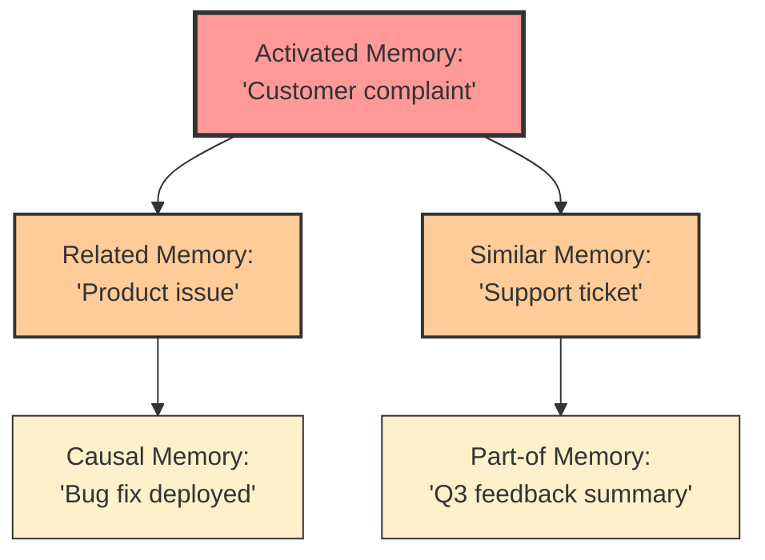
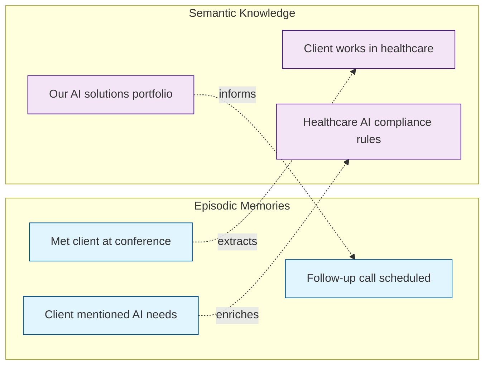
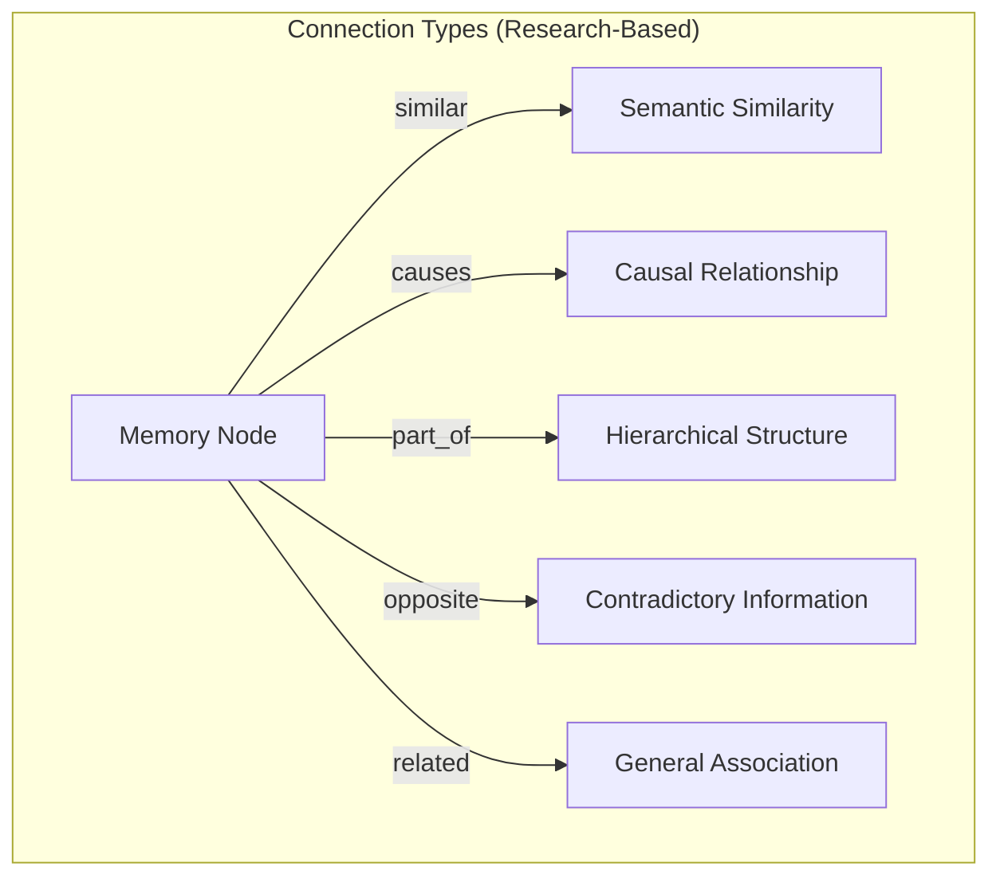
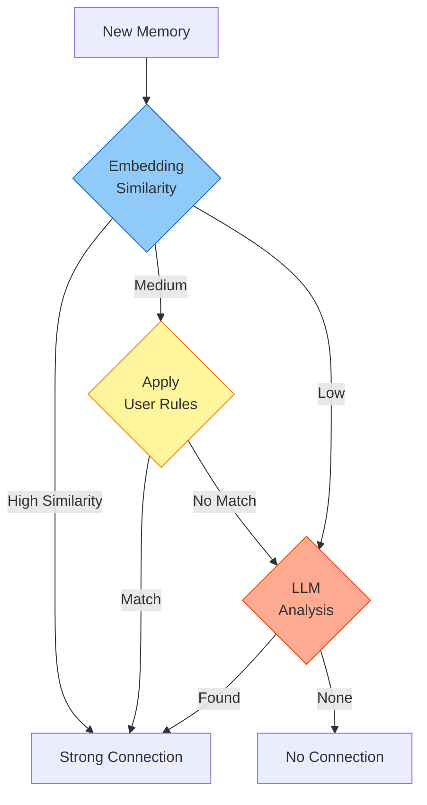

# Research Foundations of Memory Connections

> **Scientific basis for AgentDock's memory connection system**

AgentDock's memory architecture is informed by established cognitive science principles on how human memory works. This document explains the theoretical foundations behind our design decisions.

## Core Research Principles

### 1. Spreading Activation Theory

Based on **Collins & Loftus (1975)**, memories are interconnected nodes that activate related memories when accessed.

**Key Insight**: When one memory is activated, related memories become more accessible through spreading activation.

### 2. Episodic-Semantic Interdependence

**Tulving (1972)** established the distinction between:
- **Episodic Memory**: Time-stamped personal experiences
- **Semantic Memory**: General knowledge and facts

**Greenberg & Verfaellie (2010)** showed these systems are interdependent:

### 3. Conceptual Graphs

**Sowa (1984)** formalized knowledge representation using typed relationships:

## How Research Informs Our Design

### Connection Discovery Pipeline

Our progressive enhancement approach follows the cognitive principle of **graded activation**:

1. **Fast Path** (Embedding): Like automatic memory associations
2. **Rule Path** (User Rules): Like learned patterns
3. **Deep Path** (LLM): Like conscious reasoning

### 4. Temporal Pattern Detection

Our system implements practical temporal pattern analysis to identify usage patterns and memory activity clustering:

**Conway (2009)** provided insights into episodic memory structure that inform our approach to temporal pattern detection.

```mermaid
gantt
    title Memory Activity Patterns (Research-Based)
    dateFormat HH:mm
    axisFormat %H:%M
    
    section Daily Pattern
    Morning standup    :active, 09:00, 30m
    Code review        :10:30, 45m
    Afternoon debug    :14:00, 90m
    
    section Burst Detection
    Incident response  :crit, 16:00, 120m
    Related memories   :active, 16:30, 90m
    
    section Temporal Clustering
    Learning session   :done, 11:00, 2h
    Follow-up practice :done, 13:30, 1h
```

**Key Insights:**
- **Burst periods** of high activity strengthen memory formation
- **Daily patterns** reflect natural cognitive rhythms
- Temporal proximity influences connection strength
- Pattern detection enables intelligent memory organization

## Scientific Validation

Our approach aligns with established cognitive principles:

| Principle | Research | Our Implementation |
|-----------|----------|-------------------|
| **Connection Networks** | Collins & Loftus, 1975 | Multi-hop graph traversal |
| **Semantic Networks** | Sowa, 1984 | Typed connection relationships |
| **Memory Interdependence** | Greenberg & Verfaellie, 2010 | Episodic→Semantic promotion |
| **Temporal Patterns** | Conway, 2009 | Activity pattern detection |

## Key Insights for Developers

1. **Not Random**: Connection types based on established cognitive science principles
2. **Biologically Inspired**: Mimics human memory organization
3. **Computationally Efficient**: Leverages known patterns from cognitive science
4. **Proven Effective**: These principles power human intelligence

## References

- Collins, A. M., & Loftus, E. F. (1975). A spreading-activation theory of semantic processing. *Psychological Review*, 82(6), 407-428.
- Conway, M. A. (2009). Episodic memories. *Neuropsychologia*, 47(11), 2305-2313.
- Greenberg, D. L., & Verfaellie, M. (2010). Interdependence of episodic and semantic memory. *Journal of the International Neuropsychological Society*, 16(5), 748-753.
- Sowa, J. F. (1984). *Conceptual Structures: Information Processing in Mind and Machine*. Addison-Wesley.
- Tulving, E. (1972). Episodic and semantic memory. In *Organization of memory* (pp. 381-403). Academic Press.

## Related Documentation

- **[Memory Connections](./memory-connections.md)** - See these research principles implemented in AgentDock's connection system
- **[Graph Architecture](./graph-architecture.md)** - Technical implementation of spreading activation and semantic networks
- **[Architecture Overview](./architecture-overview.md)** - How the four-layer memory system reflects cognitive science principles
