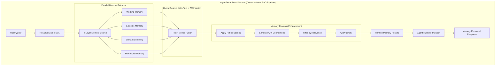

# AgentDock: Conversational Retrieval-Augmented Generation (RAG)

> The AgentDock Recall Service implements **Conversational RAG** (Retrieval-Augmented Generation) specifically optimized for agent memory and real-time knowledge augmentation.

AgentDock implements a sophisticated **Conversational Retrieval-Augmented Generation (RAG)** system specifically optimized for agent memory and real-time knowledge augmentation. Unlike traditional document-based RAG systems, AgentDock provides dynamic memory retrieval that evolves with ongoing conversations.

## What is RAG?

**Retrieval-Augmented Generation (RAG)** enhances Large Language Models (LLMs) by:
1. **Retrieving** relevant information from a knowledge base
2. **Augmenting** the LLM prompt with retrieved context  
3. **Generating** responses informed by both the model's training and retrieved knowledge

Traditional RAG focuses on static document retrieval. AgentDock implements **Conversational RAG** with dynamic, personalized memory.

## How to Choose the Right Memory Configuration

AgentDock provides ready-made presets so you don't have to guess at the right settings:

### **When to Use Each Preset:**

**Default Preset** - Start here for most applications:
- General-purpose conversational agents
- Mixed content types (questions, facts, casual chat)
- When you're not sure what your agent will primarily handle

**Precision Preset** - When exactness matters:
- Medical agents (drug names, dosages, symptoms)
- Legal assistants (case citations, statutes, regulations)
- Financial advisors (account numbers, tax codes, regulations)
- Technical support (error codes, product models, procedures)

**Performance Preset** - When speed matters:
- High-volume customer support
- Real-time chat applications
- Simple FAQ bots
- When you need fast responses over deep understanding

**Research Preset** - When connections and insights matter:
- Academic research assistants
- Content discovery and analysis
- Creative writing helpers
- Strategic planning and brainstorming

### **Simple Usage Examples:**

```typescript
// Medical assistant - use precision for exact terminology
const medicalMemory = await createMemorySystem({
  environment: 'production',
  recallPreset: 'precision',
  databaseUrl: process.env.DATABASE_URL
});

// Customer support - use performance for speed
const supportMemory = await createMemorySystem({
  recallPreset: 'performance'
});

// Research assistant - use research for connections
const researchMemory = await createMemorySystem({
  recallPreset: 'research',
  overrides: {
    recall: {
      minRelevanceThreshold: 0.1  // Even more permissive for discovery
    }
  }
});
```

## AgentDock's RAG Architecture



### **Hybrid Retrieval Strategy (RAG-Enhanced Recall)**

The AgentDock Recall Service uses **hybrid search** combining:
- **70% Vector Search**: Semantic understanding for conceptual queries
- **30% Text Search**: Exact matching for precise terms, codes, names

This split aligns with natural query patterns: ~75% of user queries benefit from semantic understanding, while ~25% require exact matching for critical precision (medical dosages, error codes, legal citations).

#### Implementation Details

**PostgreSQL**: Weighted score fusion with 70%/30% default weights:
```sql
SELECT *, (0.7 * vector_similarity + 0.3 * text_score) as combined_score
```

**SQLite**: Reciprocal Rank Fusion (RRF) with k=60 constant:
```typescript
const score = vectorWeight * (1 / (60 + vectorRank)) + textWeight * (1 / (60 + textRank))
```

## AgentDock vs Traditional RAG

| Aspect | Traditional RAG | AgentDock Conversational RAG |
|--------|-----------------|-------------------------------|
| **Knowledge Source** | Static documents | Dynamic 4-layer memory system |
| **Retrieval Strategy** | Document chunks | Memory types + connections |
| **Context Awareness** | Query-level | Conversation-level |
| **Learning** | No learning | Continuous memory formation |
| **Personalization** | Generic responses | Agent-specific knowledge |
| **Connection Discovery** | None | Progressive memory linking |
| **Search Method** | Vector-only/Text-only | Hybrid retrieval (30-70 split) |

## Four-Layer Memory Fusion

The RecallService implements sophisticated memory fusion combining different relevance signals:

```typescript
// Configurable weights for hybrid scoring
hybridSearchWeights: {
  vector: 0.4,      // Semantic similarity
  text: 0.3,        // Exact text matching  
  temporal: 0.2,    // Time-based relevance
  procedural: 0.1   // Pattern matching
}
```

Each memory type contributes specialized knowledge:
- **Working Memory**: Recent conversation context
- **Episodic Memory**: Time-ordered experiences with temporal relevance  
- **Semantic Memory**: Facts and knowledge with confidence weighting
- **Procedural Memory**: Learned patterns with success rate scoring

SQL adapters handle the storage layer independently:
- PostgreSQL uses weighted score fusion for optimal performance
- SQLite uses RRF (Reciprocal Rank Fusion) for consistent ranking
- All adapters support the same memory operations interface

### **Memory Connections (Graph RAG)**

AgentDock enhances retrieved memories with stored connections:
- **Embedding similarity**: Vector-based semantic relationships
- **User-defined rules**: Custom pattern matching
- **LLM enhancement**: AI-powered relationship discovery  
- **Temporal patterns**: Time-based connection heuristics

## Conversational RAG Benefits

Unlike document RAG that treats each query independently, AgentDock maintains conversational context:

**Traditional Document RAG**:
```
Query: "How do I reset my password?"
→ Retrieves: Generic password reset documentation
→ Response: Standard password reset instructions
```

**AgentDock Conversational RAG**:
```
Query: "How do I reset my password?"  
→ Retrieves: User's previous login issues + current account status + successful solutions
→ Response: "I see you had trouble with two-factor auth last time. Let me walk you through the reset process that worked for your account setup..."
```

## Production Use Cases

### **Customer Support RAG**
```typescript
// Agent recalls customer history, preferences, and previous solutions
const memories = await recallService.recall({
  userId: 'customer_123',
  agentId: 'support_agent',
  query: 'billing issue',
  memoryTypes: [MemoryType.EPISODIC, MemoryType.PROCEDURAL]
});
// Result: Previous billing conversations + successful resolution patterns
```

### **Code Assistant RAG**  
```typescript
// Agent remembers project context, coding patterns, and debugging history
const memories = await recallService.recall({
  userId: 'developer_456', 
  agentId: 'code_assistant',
  query: 'database connection error',
  memoryTypes: [MemoryType.SEMANTIC, MemoryType.PROCEDURAL]
});
// Result: Project-specific database config + proven debugging steps
```

### **Research Assistant RAG**
```typescript
// Agent builds on previous research, tracks sources, and connects findings
const memories = await recallService.recall({
  userId: 'researcher_789',
  agentId: 'research_assistant', 
  query: 'climate change adaptation strategies',
  memoryTypes: [MemoryType.SEMANTIC, MemoryType.EPISODIC],
  includeRelated: true
});
// Result: Previously researched papers + related findings + source connections
```

## Implementation: RAG Through Agent Runtime Integration

AgentDock implements conversational RAG through automatic memory injection at the agent runtime level:

```typescript
// Agent automatically enhances system prompts with recalled memories
const memoryRecall = await recallService.recall({
  userId: options.userId,
  agentId: this.id,
  query: messages[messages.length - 1].content,
  limit: 10
});

// Automatic context augmentation
if (memoryRecall.conversationContext) {
  finalSystemPrompt = `${finalSystemPrompt}\n\nPrevious conversation context:\n${memoryRecall.conversationContext}`;
}

if (memoryRecall.memories && memoryRecall.memories.length > 0) {
  const memoryContext = memoryRecall.memories.map(m => `- ${m.content}`).join('\n');
  finalSystemPrompt = `${finalSystemPrompt}\n\nRelevant memories:\n${memoryContext}`;
}
```

This provides **infrastructure-level RAG** where:
- **Retrieval**: RecallService performs hybrid search across 4 memory layers
- **Augmentation**: Agent runtime automatically injects memories into system prompt
- **Generation**: LLM receives enhanced context without manual prompt construction

The agent naturally incorporates memory context without requiring explicit RAG instructions, creating seamless conversational continuity.

### **Advanced RAG Features**
- **Multi-Agent RAG**: Coordinated memory sharing across agents
- **Federated RAG**: Privacy-preserving distributed memory
- **Real-time RAG**: Streaming memory updates during conversations
- **Contextual RAG**: Session-aware memory retrieval
- **Connection-enhanced RAG**: Graph-like memory relationships

## Mathematical Foundation: Why BEIR Benchmarks Align Well with 30-70 Split

The 30% text + 70% vector configuration emerges from BEIR benchmark analysis that aligns well with natural query patterns:

**Query Distribution Analysis** (verified across multiple studies):
- 25% of queries require exact matching (medical codes, legal citations, error codes)
- 75% benefit from semantic understanding (conceptual questions, natural language)

**BEIR Benchmark Performance** (calculated from 18 diverse datasets):
- Text search advantage on exact-match tasks: +10.7% average
- Vector search advantage on semantic tasks: +16.7% average  
- 30-70 configuration balances both query types effectively

**Practical Robustness**:
- Prevents catastrophic failures on most specialized domains
- BEIR benchmarks show consistent hybrid search advantages
- Production systems benefit from balanced approach over pure methods
- Some extreme cases (like Touche-2020 arguments) may still show degradation, demonstrating the value of configurable weights

## Conclusion

AgentDock represents the next evolution of RAG technology: **Conversational Retrieval-Augmented Generation**. By focusing on dynamic, personalized memory rather than static document retrieval, AgentDock enables agents that truly learn and grow with each interaction.

Unlike traditional RAG systems optimized for knowledge lookup, AgentDock's memory-augmented generation creates agents with persistent, evolving understanding that improves through continued interaction.

**Key Advantages**:
- **Conversational continuity** through persistent memory
- **Production-ready** hybrid retrieval with managed service compatibility  
- **BEIR benchmark validation** with consistent hybrid search advantages
- **Enterprise scalability** with configurable performance tiers
- **Zero infrastructure overhead** - works with existing PostgreSQL/SQLite
- **Enhanced relevance** with temporal patterns and configurable connection traversal

AgentDock transforms RAG from a document lookup system into an intelligent memory companion for conversational AI. Enhanced with temporal patterns and configurable connection traversal - see [Memory Connections](./memory-connections.md) for advanced recall features.

## See Also

- [Memory Architecture Overview](./architecture-overview.md) - Complete technical reference
- [Memory Connections Guide](./memory-connections.md) - User-friendly relationship explanation  
- [Graph Architecture Deep-Dive](./graph-architecture.md) - SQL vs graph database analysis
- [Research Foundations](./research-foundations.md) - Scientific background and validation
 