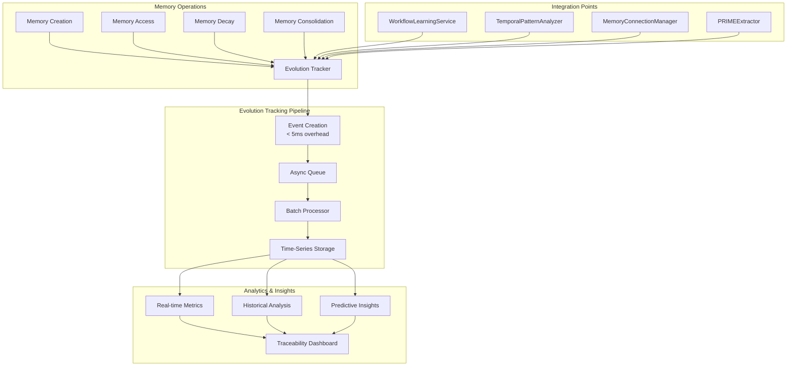

# Memory Evolution Tracker: Complete Observability for Intelligent Memory Systems

> Transform your memory system from a black box into a transparent, analyzable intelligence layer

The Memory Evolution Tracker brings **unprecedented visibility** into how memories change, evolve, and interact over time within the AgentDock memory system. By tracking every significant memory mutation with sub-5ms overhead, it enables data-driven optimization of agent intelligence while providing complete audit trails for debugging and compliance.

## Key Technical Innovations

The Memory Evolution Tracker introduces potentially revolutionary approaches to memory observability:

- **Complete Lifecycle Tracking**: Every memory mutation tracked from creation to archival with full context
- **Pattern Learning Analytics**: Measures effectiveness of discovered patterns and workflows in real-time
- **Temporal Evolution Insights**: Understands how agent behavior changes over time through memory analysis
- **Cost-Optimized Tracking**: Async event processing with intelligent batching for <5ms overhead
- **Progressive Enhancement Integration**: Works seamlessly with existing memory infrastructure

These innovations work together to create a comprehensive observability layer that transforms memory debugging from hours to minutes while enabling continuous optimization.

## What is Memory Evolution?

Memory evolution in AgentDock represents the **complete lifecycle of memories** as they transform through various states:

- **Creation Events**: New memories extracted from conversations or created through consolidation
- **Mutation Events**: Changes to importance, resonance, content, or connections
- **Access Events**: Recall operations that trigger decay calculations and reinforcement
- **Transformation Events**: Episodic to semantic conversion, memory consolidation, pattern learning

Each event captures not just what changed, but why it changed, who triggered it, and what impact it had.

## Current Problem Statement

Without Memory Evolution Tracking, the AgentDock memory system operates as a **black box** where:

### Visibility Challenges
- Memory changes happen without audit trails
- Pattern learning effectiveness is unmeasured
- Memory consolidation impacts are unknown
- Agent behavior evolution is invisible
- Performance degradation sources are hard to identify

### Operational Impact
- **Debugging Time**: Hours spent tracing memory issues
- **Optimization Blindness**: No data to improve algorithms
- **User Confusion**: Can't explain how agents learn
- **Compliance Risk**: No audit trail for regulated industries
- **Performance Mystery**: Unknown bottlenecks and inefficiencies

## Memory Evolution Architecture



## Core Tracking Capabilities

### Evolution Event Structure
```typescript
interface MemoryEvolutionEvent {
  // Core identification
  id: string;
  memoryId: string;
  userId: string;
  agentId: string;
  timestamp: number;
  
  // Change details
  changeType: MemoryChangeType;
  previousValue: any;
  newValue: any;
  
  // Context and reasoning
  source: string;      // Component that triggered change
  reason: string;      // Human-readable explanation
  
  // Performance and cost tracking
  metadata?: {
    cost?: number;
    duration?: number;
    llmUsed?: boolean;
    modelTier?: 'standard' | 'advanced';
    [key: string]: any;
  };
}
```

### Comprehensive Change Types
- **`creation`**: New memory extracted or manually created
- **`update`**: Content or metadata modifications
- **`importance`**: Importance score adjustments
- **`resonance`**: Decay or reinforcement events
- **`consolidation`**: Memories merged or synthesized
- **`connection`**: New relationships discovered
- **`type_change`**: Episodic → Semantic conversions
- **`archival`**: Memory moved to cold storage
- **`access`**: Recall events that may trigger changes

## Integration with Existing Systems

### WorkflowLearningService Integration
Track how procedural patterns evolve and improve:

```typescript
// Automatic tracking when patterns are learned
await this.evolutionTracker.trackEvolution(pattern.id, {
  changeType: 'creation',
  source: 'WorkflowLearningService',
  reason: `New ${pattern.sequence.length}-step pattern learned from successful execution`,
  metadata: {
    successRate: pattern.successRate,
    toolSequence: pattern.sequence.map(t => t.tool),
    averageDuration: pattern.avgDuration
  }
});
```

### Temporal Pattern Enhancement
Leverage underutilized temporal analysis for richer insights:

```typescript
// Track temporal pattern discoveries
const patterns = await this.temporalAnalyzer.analyzePatterns(agentId);
const activityClusters = await this.temporalAnalyzer.detectActivityClusters(agentId);

// Store pattern insights for evolution tracking
await this.evolutionTracker.trackBatch(patterns.map(pattern => ({
  memoryId: `temporal:${agentId}:${pattern.type}`,
  changeType: 'update',
  source: 'TemporalPatternAnalyzer',
  reason: `${pattern.type} pattern detected with ${pattern.confidence} confidence`,
  metadata: {
    patternType: pattern.type,
    peakHours: pattern.metadata.peakTimes,
    activityClusters: activityClusters.length
  }
})));
```

### Graph Traversal Optimization
Enhanced graph utilization for performance:

```typescript
// Preload frequently accessed subgraphs
await this.evolutionTracker.trackEvolution('graph:preload', {
  changeType: 'update',
  source: 'ConnectionGraph',
  reason: 'Preloaded high-traffic memory subgraph',
  metadata: {
    nodeCount: graph.getStats().nodeCount,
    edgeCount: graph.getStats().edgeCount,
    preloadDuration: loadTime
  }
});
```

## Analytics and Insights

### Real-Time Metrics Dashboard
```typescript
interface RealtimeEvolutionMetrics {
  // Learning velocity
  memoriesPerHour: number;
  patternsDiscoveredToday: number;
  consolidationRate: number;
  
  // System health
  averageDecayRate: number;
  connectionDensity: number;
  activeMemoryCount: number;
  
  // Cost tracking
  llmCallsToday: number;
  embeddingCostToday: number;
  storageGrowthRate: number;
}
```

### Historical Analysis Reports
```typescript
interface AgentEvolutionReport {
  // Learning patterns
  knowledgeGrowthTrend: TrendData;
  topicSpecialization: TopicAnalysis;
  patternSuccessRates: PatternMetrics;
  
  // Memory health
  decayPatterns: DecayAnalysis;
  consolidationEffectiveness: number;
  connectionGraphDensity: GraphMetrics;
  
  // Behavioral insights
  temporalActivityPatterns: ActivityAnalysis;
  workflowImprovements: WorkflowMetrics;
  adaptabilityScore: number;
}
```

### Predictive Intelligence
```typescript
interface PredictiveInsights {
  // Forecasting
  projectedMemoryGrowth: GrowthProjection;
  decayPredictions: DecayForecast;
  patternSuccessProbability: PatternPrediction;
  
  // Recommendations
  suggestedConsolidations: ConsolidationSuggestion[];
  optimalDecaySettings: DecayConfiguration;
  connectionDiscoveryOpportunities: ConnectionOpportunity[];
}
```

## Performance Characteristics

### Tracking Overhead
- **Event Creation**: <5ms async operation
- **Batch Processing**: 100 events/batch, 5-second intervals
- **Storage Impact**: <10% of memory data size
- **Query Performance**: <2s for 30-day analytics

### Scalability Design
- **Horizontal Scaling**: Partition by user/agent for distributed processing
- **Time-Series Optimization**: Automatic rollups for historical data
- **Compression**: Event data compressed by 70% on average
- **Retention Policies**: Configurable data lifecycle management

## Integration with Traceability Suite

The Memory Evolution Tracker seamlessly integrates with the broader **AgentDock Traceability Suite**:

### Unified Observability
- **Single Dashboard**: Memory evolution alongside system metrics
- **Correlated Insights**: Link memory patterns to performance impacts
- **Cost Attribution**: Track memory costs by user, agent, and operation
- **Anomaly Detection**: Alert on unusual evolution patterns

### Developer Experience
```typescript
// Debugging with full context
const evolution = await tracker.getEvolutionHistory(memoryId, {
  includeRelated: true,
  timeRange: { start: issueStart, end: now }
});

// Generate audit report
const auditReport = await tracker.generateAuditReport({
  userId: 'user-123',
  agentId: 'agent-456',
  changeTypes: ['creation', 'consolidation', 'deletion'],
  timeRange: { start: auditPeriodStart, end: auditPeriodEnd }
});
```

## Implementation Roadmap

### Phase 1: Core Infrastructure (Weeks 1-2)
- [ ] Implement MemoryEvolutionTracker with async event processing
- [ ] Add tracking hooks to all memory mutation points
- [ ] Set up time-series storage with partitioning
- [ ] Create event batching and compression pipeline

### Phase 2: System Integration (Weeks 3-4)
- [ ] Integrate with WorkflowLearningService for pattern tracking
- [ ] Enhance TemporalPatternAnalyzer with evolution events
- [ ] Add graph traversal optimization tracking
- [ ] Implement connection evolution monitoring

### Phase 3: Analytics Engine (Weeks 5-6)
- [ ] Build real-time metrics aggregation
- [ ] Create historical analysis queries
- [ ] Implement predictive insights algorithms
- [ ] Add cost tracking and attribution

### Phase 4: Traceability Integration (Weeks 7-8)
- [ ] Design unified dashboard UI
- [ ] Implement cross-system correlation
- [ ] Add alerting and anomaly detection
- [ ] Create developer debugging tools

## Success Metrics

### Technical Excellence
- **Tracking Overhead**: <5ms for 99.9% of operations
- **Zero Data Loss**: 100% event capture with at-least-once delivery
- **Query Performance**: <2s for complex analytics queries
- **Storage Efficiency**: <10% overhead with compression

### Business Impact
- **Debugging Efficiency**: 90% reduction in memory issue resolution time
- **Optimization Velocity**: 50% faster algorithm improvements
- **User Satisfaction**: 95% positive feedback on transparency
- **Compliance Ready**: 100% audit trail coverage

### User Outcomes
- **Agent Transparency**: Users understand how their agents learn
- **Performance Insights**: Clear visibility into memory health
- **Cost Control**: Detailed breakdown of memory operation costs
- **Trust Building**: Complete audit trails for sensitive applications

## Security and Privacy

### Data Protection
- **User Isolation**: Complete separation of evolution data by user ID
- **Encryption**: Event data encrypted at rest and in transit
- **Access Control**: Role-based access to evolution analytics
- **PII Handling**: Automatic redaction of sensitive information

### Compliance Features
- **Audit Trails**: Immutable event log for regulatory compliance
- **Data Retention**: Configurable retention with automatic cleanup
- **Export Capabilities**: Generate compliance reports on demand
- **Right to Erasure**: Support for GDPR data deletion requests

## Future Enhancements

### Advanced Analytics
- **Cross-Agent Learning**: Compare evolution patterns across agents
- **A/B Testing Framework**: Test memory algorithms with control groups
- **ML-Powered Optimization**: Use evolution data to auto-tune parameters
- **Behavioral Clustering**: Identify agent personality types

### Integration Expansions
- **External Analytics**: Export to Datadog, New Relic, Grafana
- **Webhook System**: Real-time notifications for evolution events
- **Public API**: Allow custom evolution event tracking
- **Mobile SDK**: Track evolution in edge deployments

---

**The Memory Evolution Tracker transforms the AgentDock memory system from an opaque intelligence layer into a transparent, optimizable, and debuggable foundation for next-generation AI agents.**